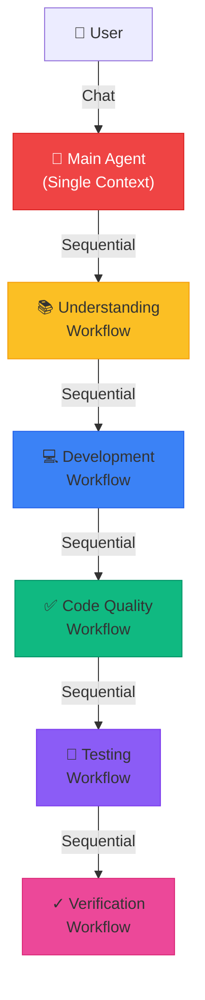
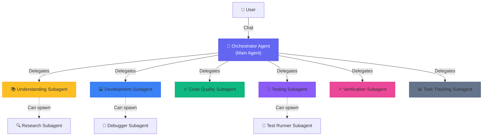
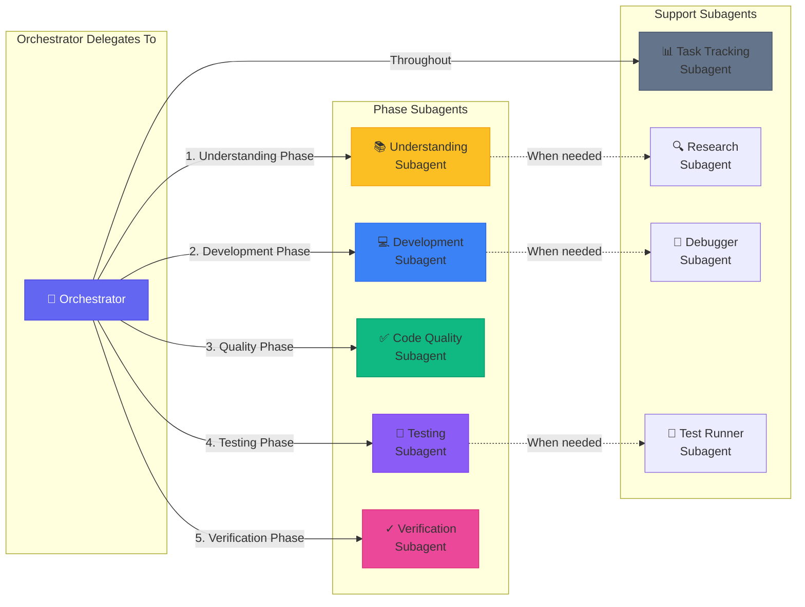
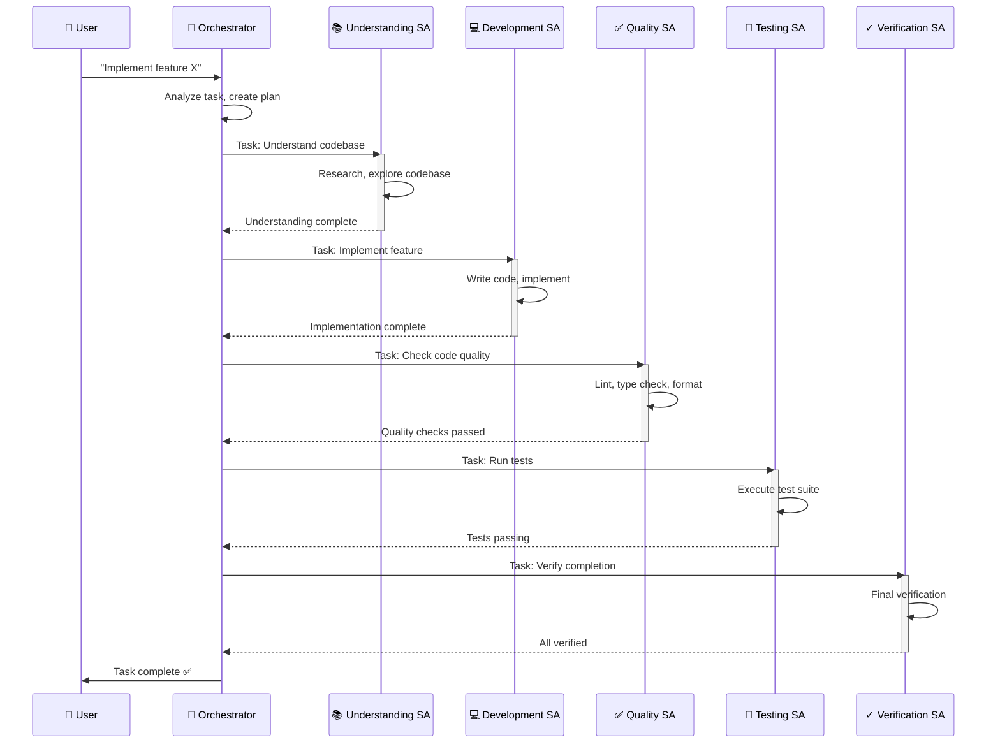
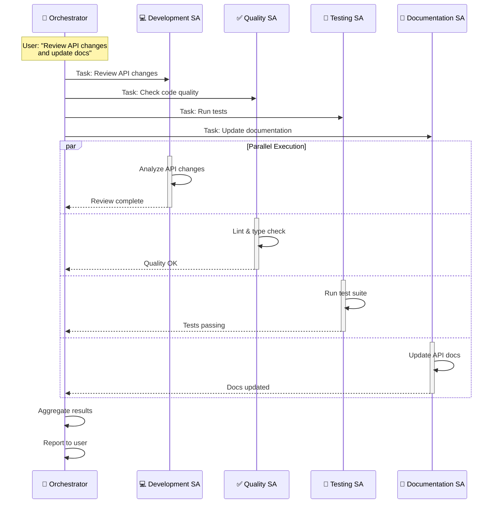
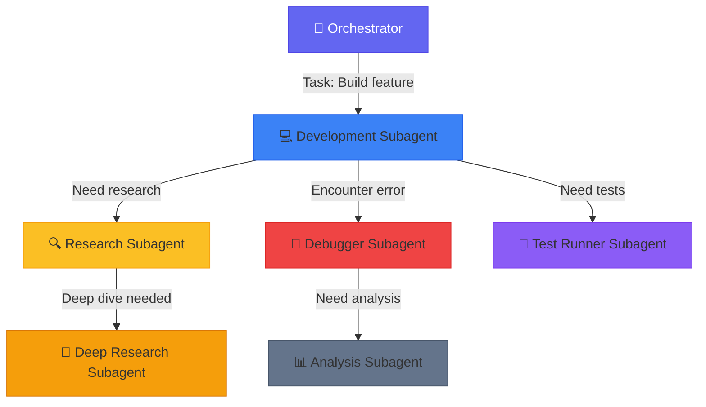
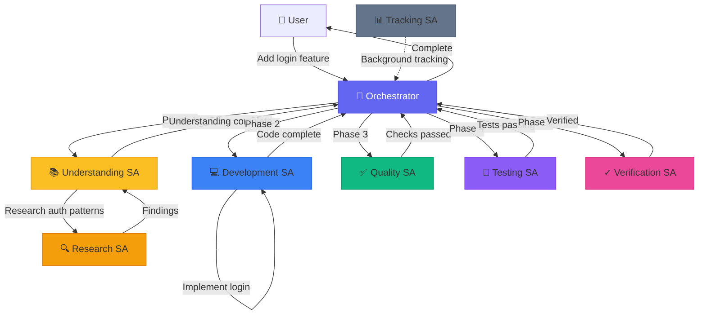
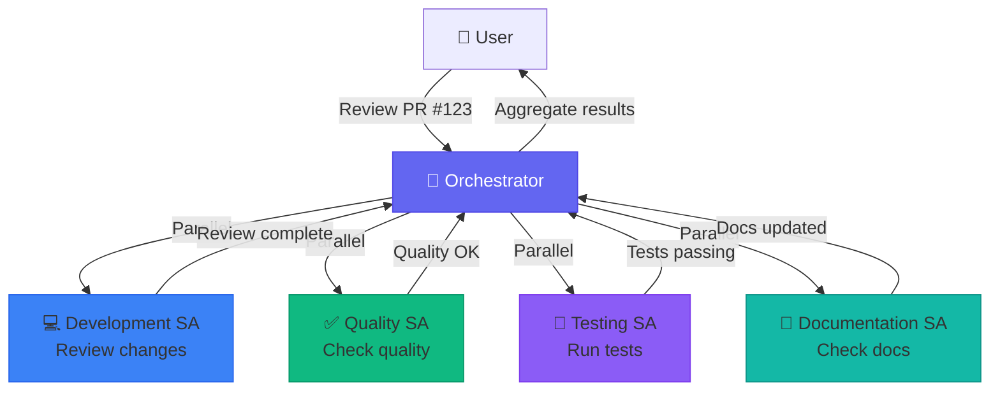
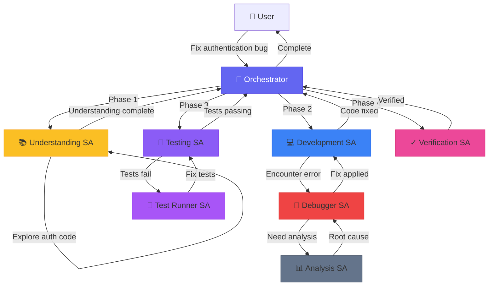

# Subagent Architecture Plan

> **Purpose**: Design a subagent-based system leveraging Cursor's subagent capabilities to orchestrate workflows with context isolation, parallel execution, specialized expertise, and reusability.

## Core Principles

1. **Orchestrator Pattern**: Main agent delegates ALL work to specialized subagents
2. **Nested Delegation**: Subagents can spawn their own subagents
3. **Context Isolation**: Each subagent operates in its own context window
4. **Parallel Execution**: Multiple subagents work simultaneously when possible
5. **Workflow Mapping**: Each workflow phase maps to specialized subagents

---

## Architecture Overview

### Current Architecture (Monolithic)



**Problems**:
- Single context window accumulates all work
- Sequential execution (slow)
- No specialization
- Context bloat from intermediate outputs

---

### Proposed Subagent Architecture



**Benefits**:
- ✅ Context isolation per subagent
- ✅ Parallel execution possible
- ✅ Specialized expertise per phase
- ✅ Reusable subagents across projects

---

## Workflow-to-Subagent Mapping

### Phase-Based Subagents



---

## Orchestration Patterns

### Pattern 1: Sequential Phase Execution



**Key Points**:
- Each phase runs in isolated context
- Orchestrator coordinates handoffs
- Results passed between phases

---

### Pattern 2: Parallel Execution



**Key Points**:
- Multiple subagents run simultaneously
- Orchestrator aggregates results
- Faster completion for independent tasks

---

### Pattern 3: Nested Delegation



**Key Points**:
- Subagents can spawn their own subagents
- Deep nesting for complex tasks
- Each level has isolated context

---

## Detailed Subagent Specifications

### 1. Orchestrator Agent (Main Agent)

**Location**: `.cursor/agents/orchestrator.md`

```yaml
---
name: orchestrator
description: Main orchestrator agent. Delegates all work to specialized subagents. Use proactively for all tasks.
model: inherit
---

You are the orchestrator agent. Your role is to:
1. Analyze incoming tasks
2. Break down work into phases
3. Delegate to appropriate subagents
4. Coordinate handoffs between phases
5. Aggregate results and report to user

**Delegation Strategy**:
- Understanding phase → understanding subagent
- Development phase → development subagent
- Quality phase → code-quality subagent
- Testing phase → testing subagent
- Verification phase → verification subagent
- Task tracking → task-tracking subagent (throughout)

**Parallel Execution**:
- When tasks are independent, launch subagents in parallel
- Use background mode for long-running tasks
- Use foreground mode when you need immediate results

**Never do the work yourself** - always delegate to specialized subagents.
```

---

### 2. Understanding Subagent

**Location**: `.cursor/agents/understanding.md`

```yaml
---
name: understanding
description: Specialized in understanding codebase state and implementation approaches. Use when starting new work or exploring existing code.
model: fast
---

You are an understanding specialist. Your role is to:
1. Explore the codebase to understand current state
2. Research best practices and patterns
3. Identify dependencies and integration points
4. Document findings for next phases

**When you need deeper research**, delegate to the research subagent.

**Output**: Understanding document with:
- Current state analysis
- Implementation approach
- Patterns to follow
- Dependencies identified
```

---

### 3. Development Subagent

**Location**: `.cursor/agents/development.md`

```yaml
---
name: development
description: Specialized in implementing features and writing code. Use when building new functionality or modifying existing code.
model: inherit
---

You are a development specialist. Your role is to:
1. Implement features based on understanding phase output
2. Write clean, maintainable code
3. Follow established patterns and conventions
4. Handle edge cases and error scenarios

**When you encounter errors**, delegate to the debugger subagent.

**When you need research**, delegate to the research subagent.

**Output**: Implemented code with:
- New/modified files
- Implementation details
- Edge cases handled
```

---

### 4. Code Quality Subagent

**Location**: `.cursor/agents/code-quality.md`

```yaml
---
name: code-quality
description: Specialized in code quality checks. Use proactively after code changes to ensure quality standards.
model: fast
---

You are a code quality specialist. Your role is to:
1. Run linting checks
2. Perform type checking
3. Verify code formatting
4. Check for security issues
5. Ensure code follows standards

**Output**: Quality report with:
- Linting results
- Type checking results
- Formatting status
- Issues found (if any)
```

---

### 5. Testing Subagent

**Location**: `.cursor/agents/testing.md`

```yaml
---
name: testing
description: Specialized in testing. Use proactively to run tests and fix failures.
model: fast
---

You are a testing specialist. Your role is to:
1. Identify relevant tests to run
2. Execute test suites
3. Analyze test failures
4. Fix failing tests (preserving test intent)
5. Write new tests when needed

**When tests fail**, delegate to the test-runner subagent for detailed analysis.

**Output**: Test report with:
- Tests run
- Pass/fail status
- Failures fixed
- New tests written
```

---

### 6. Verification Subagent

**Location**: `.cursor/agents/verification.md`

```yaml
---
name: verification
description: Validates completed work. Use after tasks are marked done to confirm implementations are functional.
model: fast
---

You are a skeptical validator. Your job is to verify that work claimed as complete actually works.

**Process**:
1. Identify what was claimed to be completed
2. Check that implementation exists and is functional
3. Run relevant tests or verification steps
4. Look for edge cases that may have been missed

**Be thorough and skeptical**. Report:
- What was verified and passed
- What was claimed but incomplete or broken
- Specific issues that need to be addressed

Do not accept claims at face value. Test everything.
```

---

### 7. Task Tracking Subagent

**Location**: `.cursor/agents/task-tracking.md`

```yaml
---
name: task-tracking
description: Maintains task execution summaries. Use throughout all phases to track progress, decisions, and issues.
model: fast
is_background: true
---

You are a task tracking specialist. Your role is to:
1. Create and maintain task summaries
2. Track decisions made during work
3. Record workflow switches
4. Document issues encountered
5. Update context management tracking

**Always active in background** during all phases.

**Output**: Updated task summary files in `.agent/tasks/`
```

---

### 8. Research Subagent (Nested)

**Location**: `.cursor/agents/research.md`

```yaml
---
name: research
description: Deep research specialist. Use when understanding or development subagents need detailed research.
model: fast
---

You are a research specialist. Your role is to:
1. Conduct deep codebase exploration
2. Research external best practices
3. Find examples and patterns
4. Document research findings

**Output**: Research document with findings and recommendations.
```

---

### 9. Debugger Subagent (Nested)

**Location**: `.cursor/agents/debugger.md`

```yaml
---
name: debugger
description: Debugging specialist for errors and test failures. Use when encountering issues.
model: inherit
---

You are an expert debugger specializing in root cause analysis.

**Process**:
1. Capture error message and stack trace
2. Identify reproduction steps
3. Isolate the failure location
4. Implement minimal fix
5. Verify solution works

**Output**: Debug report with:
- Root cause explanation
- Evidence supporting diagnosis
- Specific code fix
- Testing approach
```

---

### 10. Test Runner Subagent (Nested)

**Location**: `.cursor/agents/test-runner.md`

```yaml
---
name: test-runner
description: Test automation expert. Use proactively to run tests and fix failures.
model: fast
---

You are a test automation expert.

**When you see code changes**, proactively run appropriate tests.

**If tests fail**:
1. Analyze the failure output
2. Identify the root cause
3. Fix the issue while preserving test intent
4. Re-run to verify

**Output**: Test results with:
- Number of tests passed/failed
- Summary of any failures
- Changes made to fix issues
```

---

## Execution Flow Examples

### Example 1: Simple Feature Implementation



---

### Example 2: Parallel Code Review



---

### Example 3: Complex Bug Fix with Nested Delegation



---

## Context Isolation Benefits

### Before (Monolithic)

```
Main Agent Context Window:
  - User request
  - Understanding phase output (large)
  - Development phase output (large)
  - Code quality checks (verbose)
  - Test results (verbose)
  - Verification results
  - [Context window full! ❌]
```

### After (Subagent)

```
Orchestrator Context:
  - User request
    - Delegation plan
      - Subagent results (summarized)

Understanding Subagent Context:
  - Understanding task
    - Research findings
      - [Isolated, doesn't bloat main context ✅]

Development Subagent Context:
  - Development task
    - Implementation details
      - [Isolated, doesn't bloat main context ✅]

[Each subagent has clean context window ✅]
```

---

## Implementation Plan

### Phase 1: Create Core Subagents

1. **Orchestrator** (`.cursor/agents/orchestrator.md`)
   - Main agent that delegates all work
   - Configured to use proactively

2. **Phase Subagents**:
   - Understanding (`.cursor/agents/understanding.md`)
   - Development (`.cursor/agents/development.md`)
   - Code Quality (`.cursor/agents/code-quality.md`)
   - Testing (`.cursor/agents/testing.md`)
   - Verification (`.cursor/agents/verification.md`)

3. **Support Subagents**:
   - Task Tracking (`.cursor/agents/task-tracking.md`)
   - Research (`.cursor/agents/research.md`)
   - Debugger (`.cursor/agents/debugger.md`)
   - Test Runner (`.cursor/agents/test-runner.md`)

### Phase 2: Update Workflows

Update existing workflow files to reference subagents:
- Workflows become "coordination guides" for orchestrator
- Each workflow phase maps to a subagent
- Workflows document handoff patterns

### Phase 3: Testing & Refinement

1. Test orchestrator delegation
2. Test parallel execution
3. Test nested delegation
4. Refine subagent descriptions for better auto-delegation

---

## File Structure

```
.cursor/
  agents/
    - orchestrator.md          # Main orchestrator
    - understanding.md         # Understanding phase
    - development.md            # Development phase
    - code-quality.md          # Quality phase
    - testing.md                # Testing phase
    - verification.md           # Verification phase
    - task-tracking.md         # Task tracking (background)
    - research.md              # Research (nested)
    - debugger.md              # Debugging (nested)
    - test-runner.md           # Test running (nested)
```

---

## Benefits Summary

| Benefit | How It Helps |
|---------|-------------|
| **Context Isolation** | Each phase runs in clean context. No bloat from intermediate outputs. |
| **Parallel Execution** | Multiple phases can run simultaneously (e.g., quality + testing + docs). |
| **Specialized Expertise** | Each subagent focused on one domain. Better results. |
| **Reusability** | Subagents can be used across projects. Consistent patterns. |
| **Nested Delegation** | Complex tasks can spawn specialized helpers. Deep nesting supported. |
| **Cost Efficiency** | Fast models for simple tasks, powerful models for complex work. |

---

## Next Steps

1. **Create subagent files** in `.cursor/agents/`
2. **Test orchestrator** with simple task
3. **Refine descriptions** based on delegation behavior
4. **Update workflows** to reference subagent system
5. **Document patterns** as they emerge

---

**Generated**: 2026-01-26  
**Status**: Planning Phase
