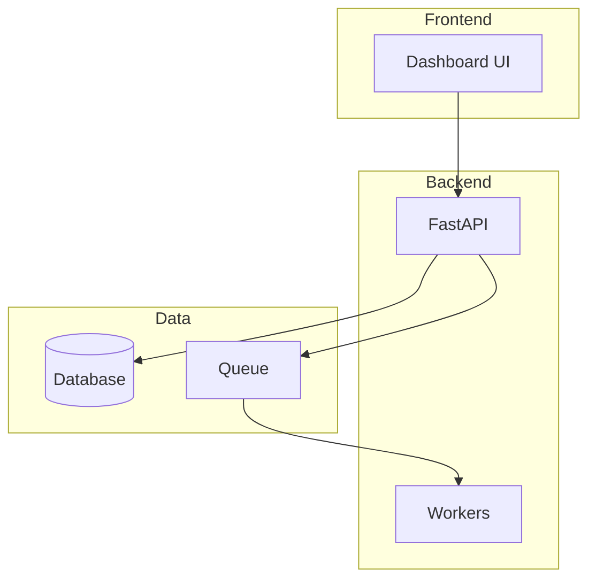
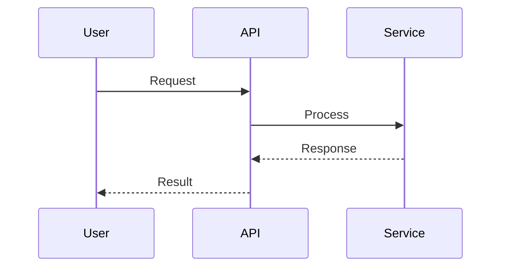

# Planning Skills

## When to Use
- New feature design
- Architecture decisions
- Sprint planning
- Technical specifications

## Sub-Skills
- `requirements/` - Gathering and documenting requirements
- `architecture/` - System design, diagrams
- `estimation/` - Effort estimation, sizing

---

## Outputs

All planning artifacts go to `.gemini/brain/<conversation>/`:
- `implementation_plan.md` - Technical design
- Architecture diagrams (Mermaid)
- Task checklist

---

## ADR Template (Architecture Decision Record)

```markdown
# ADR-XXX: [Title]

## Status
Proposed | Accepted | Deprecated | Superseded

## Context
What problem are we solving? What constraints exist?

## Decision
What is the change being proposed?

## Consequences
What are the trade-offs? Positive and negative outcomes.

## Alternatives Considered
What other options were evaluated and why were they rejected?
```

---

## Mermaid Diagram Patterns

### System Architecture


### Sequence Diagram


---

## Estimation Heuristics

| Complexity | Hours | Examples |
|------------|-------|----------|
| Trivial | 0.5-2 | Config change, copy fix |
| Simple | 2-4 | Add field, new endpoint |
| Medium | 4-16 | New feature, refactor |
| Complex | 16-40 | New subsystem, migration |
| Epic | 40+ | Architecture change |

## Product Overrides
Check: `products/{product}/skills/plan/`
