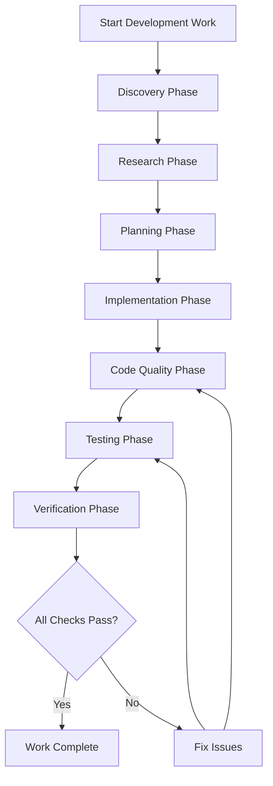

# Main Development Workflow

This is the **primary entry point** for all development work. This workflow orchestrates the complete development lifecycle from initial discovery through final verification.

## Workflow Overview



## Phase 1: Discovery

**Purpose**: Understand the current state, requirements, and context before starting work.

**Workflow**: [discovery-workflow.md](discovery-workflow.md)

**Tasks**:
1. Review existing documentation in `docs/`
2. Identify relevant code files and components
3. Understand current architecture and patterns
4. Review related issues in `.agent/issues.md`
5. Check `.agent/system-tracking.md` (runs, lessons)

**Output**: Discovery document with:
- Current state assessment
- Relevant files and components identified
- Architecture understanding
- Related work and dependencies

**Exit Criteria**: Clear understanding of what exists and what needs to be done.

---

## Phase 2: Research

**Purpose**: Research best practices, patterns, and solutions for the work to be done.

**Workflow**: [research-workflow.md](research-workflow.md)

**Tasks**:
1. Research industry best practices for the technology stack
2. Review similar implementations in the codebase
3. Identify patterns and conventions to follow
4. Research security considerations
5. Review edge cases and error handling patterns

**Output**: Research document with:
- Best practices identified
- Patterns to follow
- Security considerations
- Edge cases to handle
- References and examples

**Exit Criteria**: Clear understanding of how to implement following best practices.

---

## Phase 3: Planning

**Purpose**: Create a detailed plan for implementation, including TDD test cases.

**Workflow**: [planning-workflow.md](planning-workflow.md)

**Tasks**:
1. Update relevant documentation (add/remove features as needed)
2. Design the implementation approach
3. Define test cases (TDD approach - tests first)
4. Identify dependencies and integration points
5. Plan refactoring if needed (based on discovery/research)
6. Create implementation checklist

**Output**: Planning document with:
- Updated documentation reflecting planned changes
- Implementation design
- Test cases defined (before implementation)
- Dependencies and integration plan
- Step-by-step implementation checklist

**Exit Criteria**: Complete plan with test cases defined, ready for implementation.

---

## Phase 4: Implementation

**Purpose**: Implement the planned work following TDD principles.

**Workflow**: [tdd-implementation-workflow.md](tdd-implementation-workflow.md)

**Tasks**:
1. Write failing tests (Red phase)
2. Implement minimal code to pass tests (Green phase)
3. Refactor while keeping tests green (Refactor phase)
4. Follow code standards and patterns
5. Update documentation as code changes

**Output**: 
- Code implementation
- Passing tests
- Updated documentation

**Exit Criteria**: All planned functionality implemented, tests passing.

---

## Phase 5: Code Quality

**Purpose**: Ensure code quality, clean builds, and no warnings.

**Workflow**: [code-quality-workflow.md](code-quality-workflow.md)

**Tasks**:
1. Run linting and fix issues
2. Run type checking
3. Format code
4. Check for security issues
5. Verify clean build (no warnings)
6. Verify clean log outputs from all commands

**Commands**:
```bash
# Backend quality checks
make lint                    # Lint and format Python
uv run mypy .                # Type checking

# Frontend quality checks
make frontend-lint           # Lint TypeScript/React

# Full quality check
make dev-verify              # Includes lint, build, test, e2e
```

**Output**: 
- Clean linting (no errors, no warnings)
- Clean type checking
- Formatted code
- Clean build output
- Clean command outputs (no warnings/errors in terminal)

**Exit Criteria**: All quality checks pass, no warnings, clean outputs.

---

## Phase 6: Testing

**Purpose**: Run comprehensive tests with easy-to-view logs for debugging.

**Workflow**: [testing-workflow.md](testing-workflow.md)

**Tasks**:
1. Run unit tests (Layer 1)
2. Run agent structure tests (Layer 2)
3. Run integration tests (Layer 3) if applicable
4. Run component tests (Layer 4) for frontend
5. Run E2E tests (Layer 5) against Docker stack
6. Review logs for any failures
7. Determine if failures indicate wider issues needing refactor

**Commands**:
```bash
# Backend tests
make test-fast               # Fast tests (skip evals)
make test                    # All tests including evals

# Frontend tests
make frontend-test           # Component tests
make frontend-e2e-docker     # E2E tests against Docker stack

# Full test suite
make dev-verify              # Complete verification
```

**Log Viewing**:
```bash
# View test logs
make dev-logs-recent         # Recent Docker logs
make dev-logs-service SERVICE=phoenix  # Specific service logs

# Health check with logs
make dev-health              # Shows status and logs
```

**Failure Analysis**:
- Review logs to understand failure
- Check if failure indicates wider architectural issue
- If wider issue: document in `.agent/issues.md` and plan refactor
- If isolated issue: fix and retry

**Output**: 
- All tests passing
- Logs reviewed and clean
- Any issues identified and addressed

**Exit Criteria**: All test layers pass, logs reviewed, no unresolved issues.

---

## Phase 7: Verification

**Purpose**: Final verification that everything works in the deployed environment.

**Workflow**: [verification-workflow.md](verification-workflow.md)

**Tasks**:
1. Reset dev environment
2. Start full stack (Docker + API + Frontend)
3. Verify all services healthy
4. Run E2E tests against deployed stack
5. Manual UI verification if applicable
6. Verify clean logs from all services

**Commands**:
```bash
# Full verification
make dev-verify              # Complete verification pipeline

# Manual verification
make dev-reset               # Reset environment
make dev-up                  # Start stack
make dev-health              # Check health
make frontend-e2e-docker     # E2E tests
```

**Output**: 
- All services running and healthy
- E2E tests passing
- Clean logs from all services
- UI verified (if applicable)

**Exit Criteria**: Complete system verified, all services healthy, all tests passing.

---

## Issue Tracking

**During any phase**, if issues are encountered:

1. **Document in `.agent/issues.md`**:
   - Issue description
   - Phase where encountered
   - Impact assessment
   - Proposed solution
   - Status (open/in-progress/resolved)

2. **Assess if wider refactor needed**:
   - If issue indicates architectural problem → plan refactor
   - If isolated issue → fix and continue

3. **Update system tracking**: Add run entry to `.agent/system-tracking.md` (what worked, issues, suggestions). Extract durable lessons when appropriate.

---

## Workflow Execution Modes

### Sequential Execution
Run phases one after another (default for most work):
```
Discovery → Research → Planning → Implementation → Quality → Testing → Verification
```

### Parallel Execution
Some phases can run in parallel:
- Research can run while reviewing discovery
- Code quality can run while writing tests
- Multiple test layers can run in parallel

### Branching
Workflow can branch based on findings:
- Discovery finds major issue → Branch to refactor workflow
- Testing finds architectural issue → Branch to refactor planning
- Quality finds pattern issue → Branch to update standards

---

## Success Criteria

Work is considered complete when:

- ✅ All phases completed successfully
- ✅ Documentation updated
- ✅ Code quality checks pass (no warnings)
- ✅ All tests pass (all layers)
- ✅ E2E tests pass against Docker stack
- ✅ All services healthy with clean logs
- ✅ No unresolved issues
- ✅ System tracking updated

---

## Quick Reference

**Start Development**:
1. Run Discovery workflow
2. Run Research workflow  
3. Run Planning workflow
4. Run TDD Implementation workflow
5. Run Code Quality workflow
6. Run Testing workflow
7. Run Verification workflow

**Check Status**:
- `make dev-health` - Service health
- `make dev-logs-recent` - Recent logs
- Review `.agent/issues.md` - Current issues
- Review `.agent/system-tracking.md` - Runs, lessons

**Fix Issues**:
- Review logs: `make dev-logs-recent`
- Check health: `make dev-health`
- Document in `.agent/issues.md`
- Assess if refactor needed
- Fix and retry from appropriate phase
