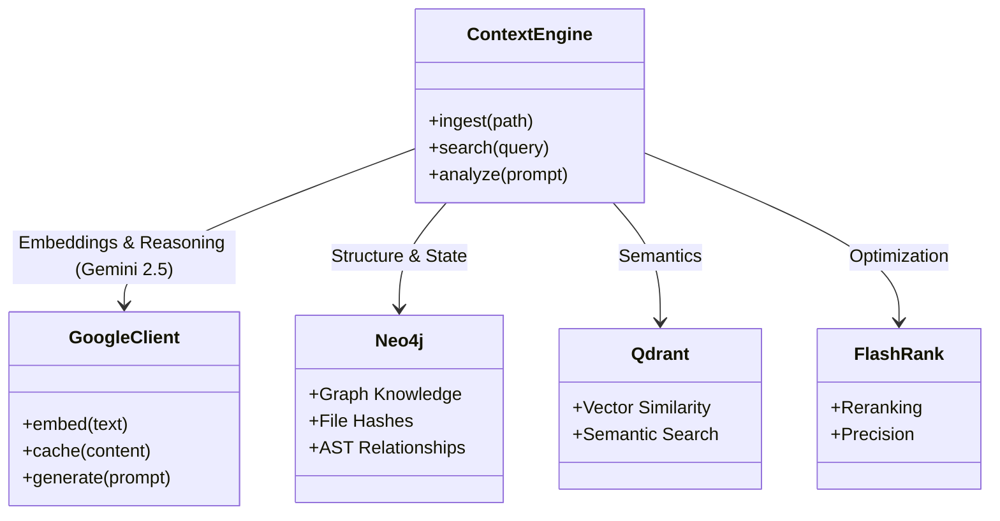
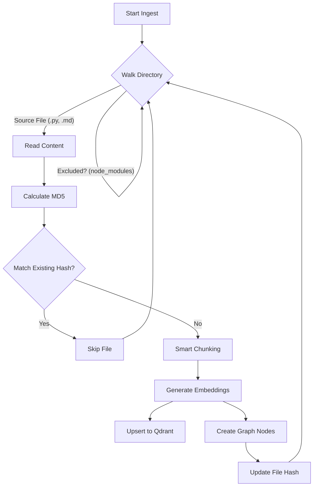
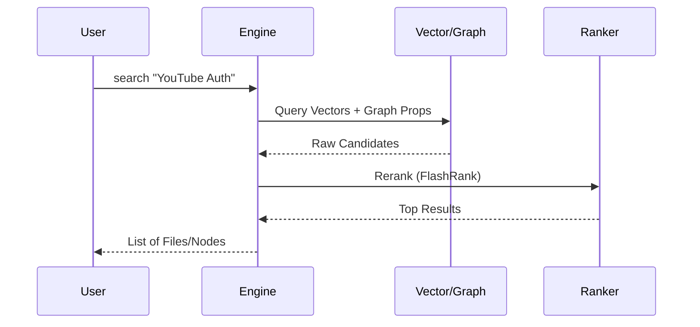
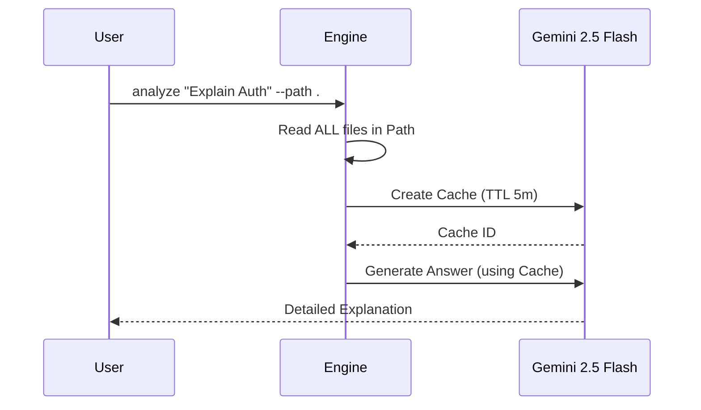

# Context Engine: Technical Design & Operation Manual

**Version:** 2.6 (Gemini 2.5 Flash Upgrade)
**Status:** Production-Ready

## 1. System Architecture
The **ContextEngine** is a hybrid retrieval system designed to bridge the gap between static code analysis and LLM reasoning. It allows an agent to "know" the codebase through two distinct mechanisms: **Semantic Search (RAG)** and **Deep Context Analysis (Caching)**.

---

## 2. Ingestion Pipeline (Incremental)
To handle large codebases efficiently, the system uses an **Incremental Ingestion** strategy. It tracks file hashes in the Graph Database to avoid processing unchanged files, saving time and API costs.

- **Smart Chunking**: Uses AST for Python (classes/functions) and Header splitting for Markdown.
- **Idempotency**: All IDs are deterministic. Re-running ingest on valid files updates them without duplication.

---

## 3. Retrieval Modes: RAG vs. Analysis

The system offers two primary ways to interact with the code. Understanding the difference is critical for effective usage.

### Mode A: Semantic Search (RAG)
**Best for:** Finding specific files, functions, or concepts. "Where is X implemented?"
**Mechanics:** vector similarity + graph traversal.

### Mode B: Deep Analysis (Context Caching)
**Best for:** Reasoning, summarization, and complex questions. "How does Auth work?"
**Mechanics:** Uploads the **entire** target directory to Google's Context Cache, allowing the LLM to "see" every file at once.

> **Critial Note**: `analyze` only sees files in the `--path` you provide. It does *not* query the database. It reads the files *live* from the disk.

---

## 4. Operation Reference

### CLI Commands
| Command | Arguments | Description |
| :--- | :--- | :--- |
| `ingest` | `<path>` | Ingests a directory into the Graph/Vector DB. |
| `search` | `<query>` | Searches the Knowledge Graph. |
| `analyze` | `<prompt> --path <dir>` | Uses Gemini 2.5 Flash to reason over the directory. |
| `stats` | (none) | Shows database node counts and health. |
| `wipe` | (none) | Clears all databases (Use with caution). |

### Configuration
- **Model**: `gemini-2.5-flash` (Analysis), `gemini-embedding-001` (Vectors).
- **Graph**: Neo4j (Local).
- **Vector**: Qdrant (Local).
