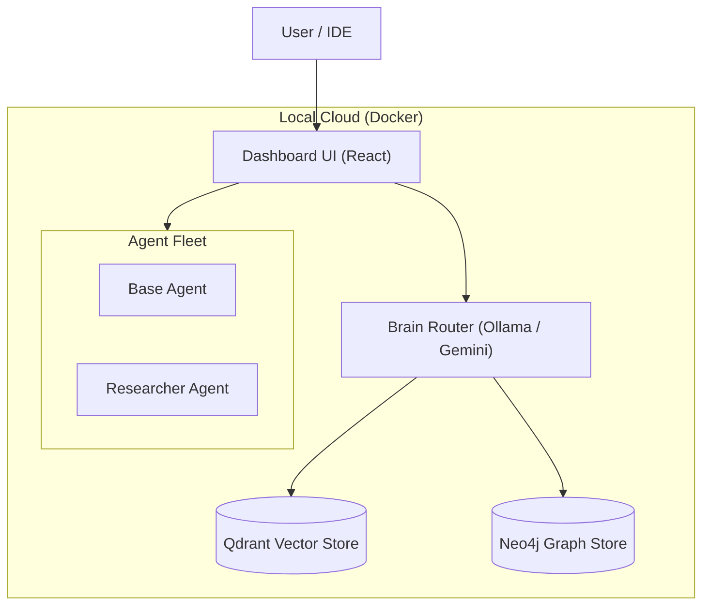
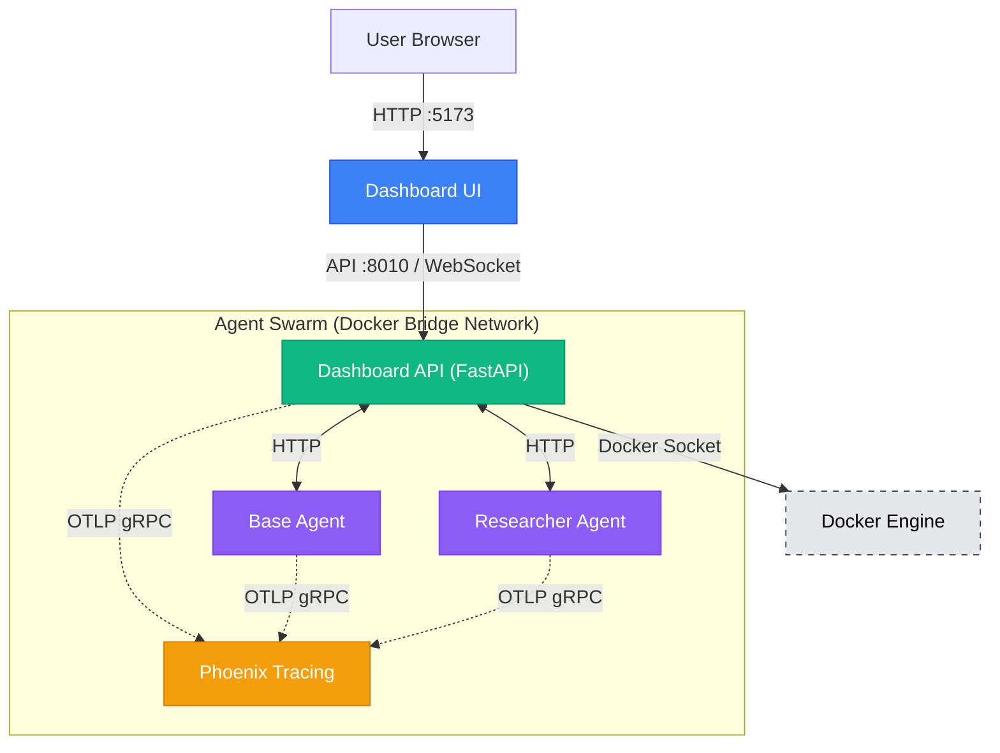

# System Architecture

> **Last verified**: 2026-01-26

## Overview
Antigravity operates as a **Local Cloud**, treating your development machine as a private cluster. All services, including specialist agents, are defined in a unified `docker-compose.yml` stack.

## 🏗 High-Level Topology



## 🧩 Core Components

### 1. Orchestrator (Dashboard)
*   **Role**: The central command center. A React v19 application referenced in `frontend/`.
*   **Function**: Manages agent lifecycles, visualizes "thoughts", and provides a chat interface for complex task delegation.

### 2. The "Brain"
*   **Role**: Inference and Context Management.
*   **Implementation**: A hybrid router that selects between:
    *   **Online**: Google Gemini / OpenAI (for reasoning/planning).
    *   **Local**: Ollama running Llama-3/DeepSeek (for speed/privacy).
*   **Data Stores**:
    *   **Neo4j**: Storing code relationships and concepts (Knowledge Graph).
    *   **Qdrant**: Fast embedding search for RAG.

### 3. Agent Fleet
Agents are standalone Docker containers that expose a standardized API (Google ADK protocol).
*   **Location**: `agents/` (Source of Truth).
*   **Baseline**: `base_agent` — minimal baseline agent for feature parity, testing baseline, and eval harness. Intentionally kept as foundation/template agent.
*   **Reference**: `researcher_agent` — full reference implementation with web tools. Use as the reference when adding new agents or validating the platform.
*   **Pattern**: Python-based agents defined in `agent.py` with `root_agent`.
    *   **Note**: `root_agent` is the required Google ADK pattern — each agent must export a `root_agent` variable from `agent.py`. This is the standard entry point for ADK agents.

## 🤖 Subagent System (Cursor IDE)

The development workflow uses a **subagent architecture** within Cursor IDE for orchestrating development tasks:

*   **Location**: `.cursor/agents/` (Subagent definitions)
*   **Orchestrator**: Main agent delegates all work to specialized subagents
*   **Benefits**: Context isolation, parallel execution, specialized expertise, reusability
*   **Workflows**: `.agent/workflows/` coordinate with subagents

**Key Subagents**:
*   **Understanding**: Codebase exploration and research
*   **Development**: Code implementation using TDD
*   **Code Quality**: Linting, type checking, security review
*   **Testing**: Test execution across all layers
*   **Verification**: Final validation in deployed environment
*   **Task Tracking**: Background progress tracking

**See**: [SUBAGENT_SYSTEM.md](SUBAGENT_SYSTEM.md) for full documentation

## 🧠 Hybrid Intelligence Strategy

We leverage a "Best Tool for the Job" approach:

| Capability | Model Source | Examples | Use Case |
| :--- | :--- | :--- | :--- |
| **Reasoning & Planning** | **Cloud** | Gemini Ultra, GPT-4o | Architecting features, complex refactors. |
| **Speed & Privacy** | **Local (GPU)** | Llama-3, DeepSeek-Coder | Syntax fixing, simple chat, auto-complete. |
| **Vision** | **Cloud** | Imagen, Gemini Pro Vision | UI design generation, screenshot analysis. |

## 📂 Directory Structure

*   `agents/`: Domain-specific agent implementations (The Fleet).
*   `agent_platform/`: Shared core libraries, auth, and config.
*   `frontend/`: The React-based Orchestrator UI.
    *   **Note**: Currently contains both frontend (`src/`) and backend API (`server.py`, `routers/`, `utils/`). See [API Layer Separation](#api-layer-separation) below.
*   `.cursor/agents/`: Cursor IDE subagent definitions (development workflow orchestration).
*   `.agent/workflows/`: Development workflow definitions that coordinate with subagents.
*   `docs/`: This documentation.

## 🔧 API Layer Separation

**Status**: ✅ **Completed**

The Dashboard API has been successfully separated from the frontend into a dedicated `dashboard_api/` module.

**Current Structure**:
```
dashboard_api/          # Dedicated API module
├── __init__.py
├── server.py           # FastAPI app entrypoint
├── routers/            # API route handlers
│   ├── agents.py
│   ├── docker.py
│   ├── system.py
│   └── usage.py
├── services.py         # Business logic
├── models.py           # Pydantic models
├── dependencies.py     # FastAPI dependencies
├── constants.py        # API constants
└── utils/              # Backend utilities
    ├── agent_registry.py
    └── docker_utils.py

frontend/               # Frontend-only
├── src/                # React application
├── package.json
└── vite.config.ts
```

**Benefits Achieved**:
*   ✅ Clear separation of concerns
*   ✅ Independent testing of API layer (tests in `dashboard_api/tests/`)
*   ✅ Easier to add alternative clients (CLI, mobile apps)
*   ✅ Better deployment flexibility
*   ✅ Cleaner dependency management
*   ✅ API runs independently: `uv run python dashboard_api/server.py` (port 8010)

## 🕸 Detailed Network Topology

The following diagram illustrates the detailed interaction between the Dashboard (UI and API), Docker, and the Agent Swarm.



## Conclusion

This architecture provides a scalable, modular foundation for the Antigravity Agent Platform. The separation of concerns between the Dashboard UI, API layer, and agent fleet enables independent development and deployment. The hybrid intelligence strategy balances performance, privacy, and cost-effectiveness, while the Docker-based Local Cloud approach simplifies development and operations. The subagent system within Cursor IDE further enhances development workflow efficiency through specialized task delegation.