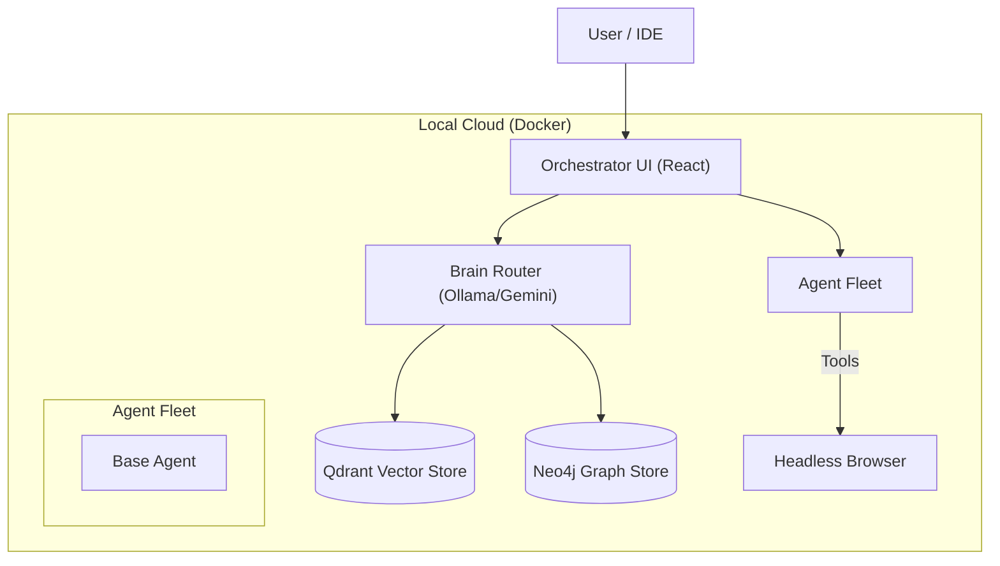
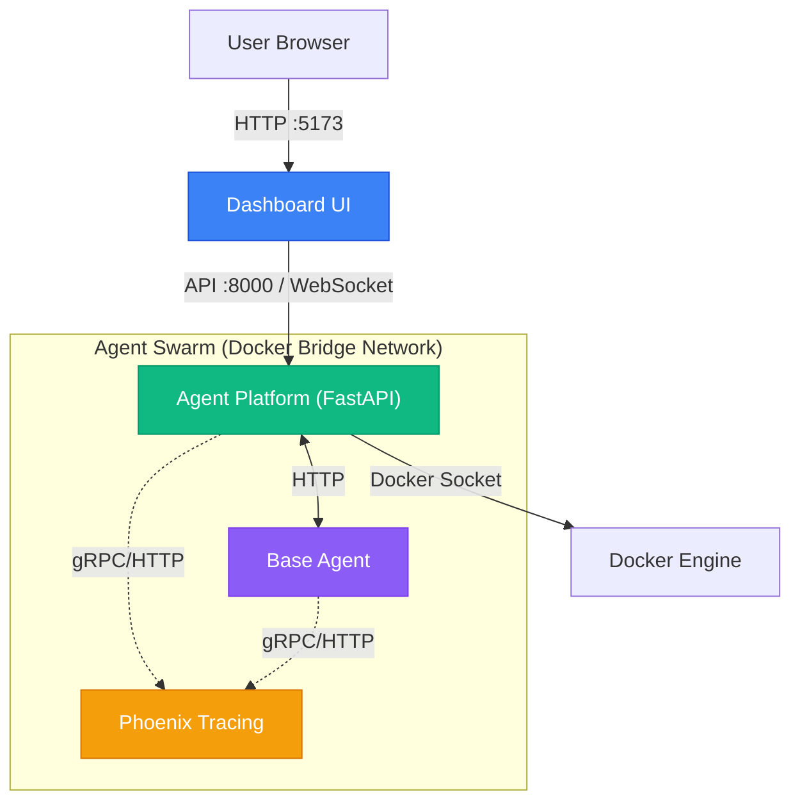

# System Architecture

## Overview
Antigravity operates as a **Local Cloud**, treating your development machine as a private cluster. All services, including specialist agents, are defined in a unified `docker-compose.yml` stack.

## 🏗 High-Level Topology

## 🧩 Core Components

### 1. Orchestrator (Dashboard)
*   **Role**: The central command center. A React v19 application referenced in `frontend/`.
*   **Function**: Manages agent lifecycles, visualizes "thoughts", and provides a chat interface for complex task delegation.

### 2. The "Brain"
*   **Role**: Inference and Context Management.
*   **Implementation**: A hybrid router that selects between:
    *   **Online**: Google Gemini / OpenAI (for reasoning/planning).
    *   **Local**: Ollama running Llama-3/DeepSeek (for speed/privacy).
*   **Data Stores**:
    *   **Neo4j**: Storing code relationships and concepts (Knowledge Graph).
    *   **Qdrant**: Fast embedding search for RAG.

### 3. Agent Fleet
Agents are standalone Docker containers that expose a standardized API (Google ADK protocol).
*   **Location**: `agents/` (Source of Truth).
*   **Pattern**: Python-based agents defined in `agent.py` with `root_agent`.

## 🧠 Hybrid Intelligence Strategy

We leverage a "Best Tool for the Job" approach:

| Capability | Model Source | Examples | Use Case |
| :--- | :--- | :--- | :--- |
| **Reasoning & Planning** | **Cloud** | Gemini Ultra, GPT-4o | Architecting features, complex refactors. |
| **Speed & Privacy** | **Local (GPU)** | Llama-3, DeepSeek-Coder | Syntax fixing, simple chat, auto-complete. |
| **Vision** | **Cloud** | Imagen, Gemini Pro Vision | UI design generation, screenshot analysis. |

## 📂 Directory Structure

*   `agents/`: Domain-specific agent implementations (The Fleet).
*   `agent_platform/`: Shared core libraries, auth, and config.
*   `frontend/`: The React-based Orchestrator UI.
*   `docs/`: This documentation.

## 🕸 Detailed Network Topology

The following diagram illustrates the detailed interaction between the Dashboard, Orchestrator, and the Agent Swarm.

