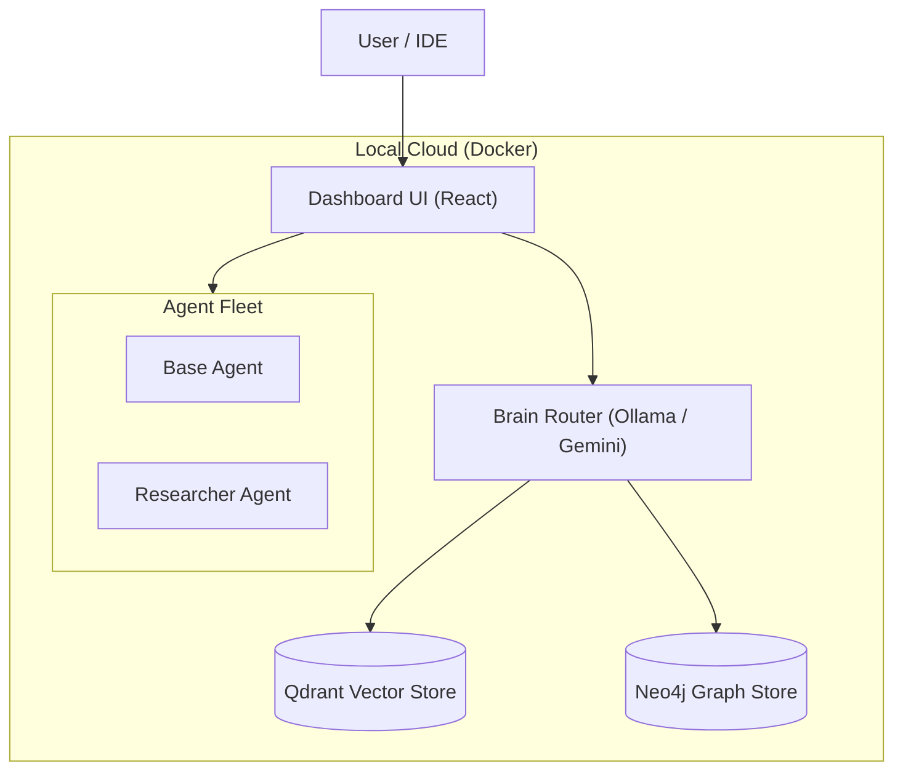
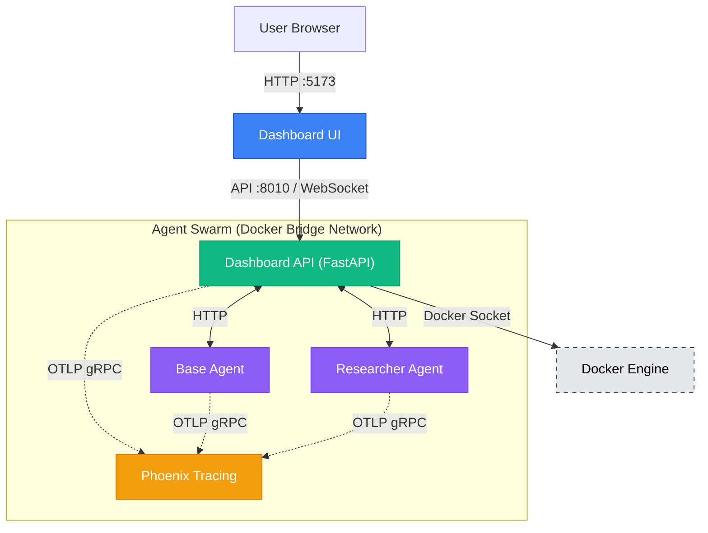

# System Architecture

> **Last verified**: 2026-01-25

## Overview
Antigravity operates as a **Local Cloud**, treating your development machine as a private cluster. All services, including specialist agents, are defined in a unified `docker-compose.yml` stack.

## 🏗 High-Level Topology



## 🧩 Core Components

### 1. Orchestrator (Dashboard)
*   **Role**: The central command center. A React v19 application referenced in `frontend/`.
*   **Function**: Manages agent lifecycles, visualizes "thoughts", and provides a chat interface for complex task delegation.

### 2. The "Brain"
*   **Role**: Inference and Context Management.
*   **Implementation**: A hybrid router that selects between:
    *   **Online**: Google Gemini / OpenAI (for reasoning/planning).
    *   **Local**: Ollama running Llama-3/DeepSeek (for speed/privacy).
*   **Data Stores**:
    *   **Neo4j**: Storing code relationships and concepts (Knowledge Graph).
    *   **Qdrant**: Fast embedding search for RAG.

### 3. Agent Fleet
Agents are standalone Docker containers that expose a standardized API (Google ADK protocol).
*   **Location**: `agents/` (Source of Truth).
*   **Baseline**: `base_agent` — minimal baseline agent for feature parity, testing baseline, and eval harness. Intentionally kept as foundation/template agent.
*   **Reference**: `researcher_agent` — full reference implementation with web tools. Use as the reference when adding new agents or validating the platform.
*   **Pattern**: Python-based agents defined in `agent.py` with `root_agent`.
    *   **Note**: `root_agent` is the required Google ADK pattern — each agent must export a `root_agent` variable from `agent.py`. This is the standard entry point for ADK agents.

## 🧠 Hybrid Intelligence Strategy

We leverage a "Best Tool for the Job" approach:

| Capability | Model Source | Examples | Use Case |
| :--- | :--- | :--- | :--- |
| **Reasoning & Planning** | **Cloud** | Gemini Ultra, GPT-4o | Architecting features, complex refactors. |
| **Speed & Privacy** | **Local (GPU)** | Llama-3, DeepSeek-Coder | Syntax fixing, simple chat, auto-complete. |
| **Vision** | **Cloud** | Imagen, Gemini Pro Vision | UI design generation, screenshot analysis. |

## 📂 Directory Structure

*   `agents/`: Domain-specific agent implementations (The Fleet).
*   `agent_platform/`: Shared core libraries, auth, and config.
*   `frontend/`: The React-based Orchestrator UI.
    *   **Note**: Currently contains both frontend (`src/`) and backend API (`server.py`, `routers/`, `utils/`). See [API Layer Separation](#api-layer-separation) below.
*   `docs/`: This documentation.

## 🔧 API Layer Separation

**Previous State**: The Dashboard API was previously located in the `frontend/` directory but has been moved to `dashboard_api/` for better separation.

**Current State**: The Dashboard API is now located in the `dashboard_api/` directory:
*   `dashboard_api/server.py` - FastAPI server entrypoint
*   `dashboard_api/routers/` - API route handlers
*   `dashboard_api/utils/` - Backend utilities (agent_registry, docker_utils)
*   `dashboard_api/models.py` - Backend Pydantic models

**Issue**: This structure couples the API layer with the frontend, making it harder to:
*   Test the API independently
*   Deploy the API separately
*   Reuse the API with other clients (CLI, mobile, etc.)
*   Maintain clear separation of concerns

**Recommended Refactoring**: Move the API layer to a separate module:
```
dashboard_api/          # New dedicated API module
├── __init__.py
├── server.py           # FastAPI app (moved from frontend/server.py)
├── routers/            # API routes (moved from frontend/routers/)
├── services/           # Business logic
├── models.py           # Pydantic models (moved from frontend/models.py)
└── utils/              # Backend utilities (moved from frontend/utils/)

frontend/               # Frontend-only
├── src/                # React application
├── package.json
└── vite.config.ts
```

**Benefits**:
*   ✅ Clear separation of concerns
*   ✅ Independent testing of API layer
*   ✅ Easier to add alternative clients (CLI, mobile apps)
*   ✅ Better deployment flexibility
*   ✅ Cleaner dependency management

## 🕸 Detailed Network Topology

The following diagram illustrates the detailed interaction between the Dashboard (UI and API), Docker, and the Agent Swarm.



