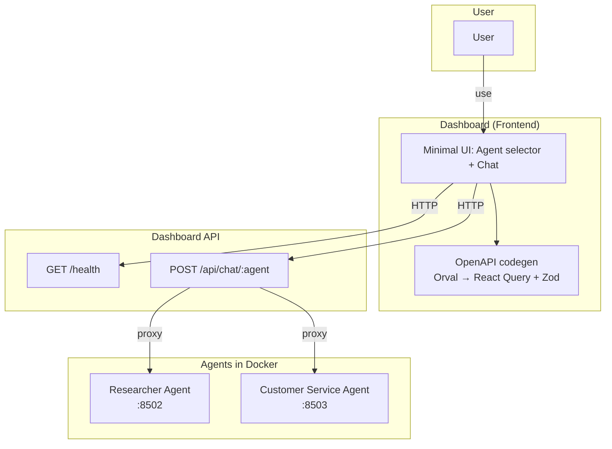

# Dashboard Baseline — Simple Agent Interaction

**Goal:** A minimal dashboard to **interact with agents** (researcher, customer service) running in Docker. No utility UIs (Docker viewer, agent lists, models, skills, artifacts, usage, etc.). Baseline = **chat-only** for researcher + customer service.

---

## How It Works (Diagram)

```
┌─────────────────────────────────────────────────────────────────────────────┐
│                              USER                                            │
└─────────────────────────────────────┬───────────────────────────────────────┘
                                      │
                                      ▼
┌─────────────────────────────────────────────────────────────────────────────┐
│  DASHBOARD (Frontend)                                                        │
│  • Minimal UI: agent selector (Researcher | Customer Service) + chat         │
│  • OpenAPI codegen (Orval) → types, client, React Query hooks                │
│  • Single page, no tabs for “Infrastructure”, “Usage”, etc.                  │
└─────────────────────────────────────┬───────────────────────────────────────┘
                                      │ HTTP (REST)
                                      ▼
┌─────────────────────────────────────────────────────────────────────────────┐
│  DASHBOARD API (Backend)                                                     │
│  • Health check                                                              │
│  • POST /api/chat/{agent} — proxy to agent (body: message, session_id)       │
│  • OpenAPI spec = source of truth for frontend codegen                       │
└─────────────────────────────────────┬───────────────────────────────────────┘
                                      │ proxy to
                    ┌─────────────────┴─────────────────┐
                    ▼                                   ▼
┌───────────────────────────────┐     ┌───────────────────────────────┐
│  RESEARCHER AGENT (Docker)    │     │  CUSTOMER SERVICE AGENT        │
│  • Research / web tools       │     │  (Docker)                      │
│  • Port 8502                  │     │  • Support / guardrails        │
│                               │     │  • Port 8503                   │
└───────────────────────────────┘     └───────────────────────────────┘
```

**Flow:** User picks an agent → sends messages in chat → Dashboard API forwards to the chosen agent in Docker → response streams back to the UI.

---

## Mermaid Diagram (for docs that render it)



---

## What We Remove (All Utility Features)

| Removed | Purpose |
|--------|---------|
| Docker viewer / Infrastructure | List containers, control start/stop, view logs |
| Agent list / discovery | List agents, metadata, config viewer |
| Models view | List Gemini models |
| Skills view | List skills, skill docs |
| Artifacts view | List artifacts, serve files |
| Usage & quotas | Usage metrics, quota detail |
| Verification runner | Run verification tests |
| Benchmark runner | Run benchmark stream |
| System operations | System fix, status panel |
| Generator view | Image generation, multi-agent chat beyond baseline |
| Telemetry logging | Optional: can drop or keep single error log endpoint |

**Result:** No tabs, no side panels for “Infrastructure”, “Usage”, “Models”, etc. Only **agent selector + chat**.

---

## What We Keep (Baseline)

| Kept | Purpose |
|------|---------|
| **Health** | `GET /health` — is the API up? |
| **Chat** | `POST /api/chat/{agent}` — send message, stream reply. Agents: `researcher_agent`, `customer_service_agent`. |
| **Minimal UI** | One screen: choose agent (Researcher | Customer Service), then chat. |
| **OpenAPI → Orval** | Single source of truth; generated types + client + hooks. |
| **Docker** | Agents run in Docker (researcher, customer_service). No UI for Docker; we just use them. |

---

## Scope Summary

- **Backend:** Dashboard API reduced to **health + chat proxy**. Chat proxy forwards to researcher (8502) or customer_service (8503).
- **Frontend:** Single-page app with **agent selector + chat**. Orval generates API layer from OpenAPI. All custom/utility features removed.
- **Agents:** Researcher + Customer Service only. Both run in Docker; dashboard does not manage or inspect Docker.

This baseline gives a clean, minimal dashboard to interact with those two agents for future use cases.

**Cleanup done:** The frontend has been stripped to this baseline: `ChatView` (agent selector + chat), minimal `api` client (chat stream only), no tabs or utility views. Orval/codegen is planned per [FRONTEND_REWRITE_PLAN](./FRONTEND_REWRITE_PLAN.md) but not yet applied.

---

## Implementation Note

The current dashboard API does **not** expose `POST /api/chat/{agent}`. For this baseline:

1. **Add a chat router** (or extend an existing one) that implements `POST /api/chat/{agent}`.
2. **Proxy** requests to `researcher_agent` (port 8502) or `customer_service_agent` (port 8503) depending on `{agent}`. Use the same request/response shape the ADK agent servers expect (e.g. `message`, `session_id`).
3. **Document** the chat endpoint in the OpenAPI spec so Orval can generate the client.
4. **Strip** all other routes (Docker, agents list, models, skills, artifacts, usage, verify, benchmark, system) from the baseline API—or leave them in the backend but **do not** surface them in the minimal UI.
