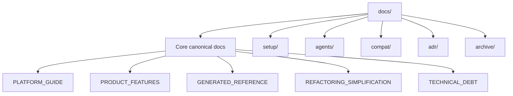

# Diagram Index

**Last updated:** 2026-02-07

This index centralizes high-value architecture and process diagrams.

## 1. System and Runtime

Primary source: `docs/PLATFORM_GUIDE.md`

- Runtime architecture
- Chat request lifecycle
- CI/CD lifecycle
- GitHub OIDC -> GCP WIF auth flow
- Cloud deployment topology
- Local dev loop
- GCP release loop
- CI/CD config dependency graph

## 2. Product and Features

Primary sources:
- `docs/PRODUCT_FEATURES.md`
- `docs/GENERATED_API_DIAGRAMS.md`

- Capability map
- Baseline frontend interaction
- Chat execution sequence
- Docker operations flow
- Usage/quota flow
- Context-engine ingestion and retrieval flows
- Feature domain -> API surface map
- OpenAPI domain -> endpoint surface map (generated)
- OpenAPI operation matrix by domain (generated)
- Product constraints and mitigations

## 3. Refactor and Debt Tracking

Primary sources:
- `docs/REFACTORING_SIMPLIFICATION.md`
- `docs/TECHNICAL_DEBT.md`

- Refactor status snapshot
- Refactor dependency map
- Suggested execution sequence
- Debt intake -> prioritization -> execution loop
- Debt theme map and ownership flow

## 4. Docs Information Architecture

Primary source: `docs/README.md`

