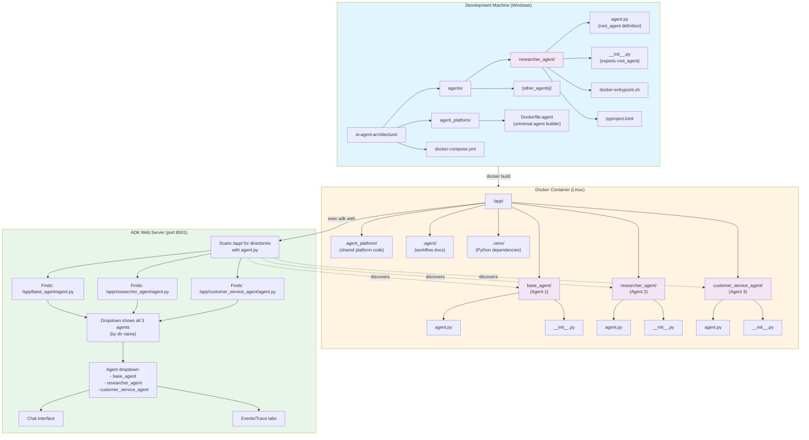

# Docker Agent Architecture

## Overview

This document explains how agents are built and deployed using Docker, and how the ADK web UI works in this setup.

## Architecture Diagram



## Build Process

### 1. Docker Build

```bash
docker build -f agent_platform/Dockerfile.agent \
  --build-arg AGENT_PATH=agents/researcher_agent \
  -t researcher-agent:latest .
```

**Steps:**
1. **Builder stage**: Installs dependencies using `uv`
2. **Runtime stage**: Copies agent to `/app/{agent_name}/` (not `/app/agent/`)
3. **Entrypoint**: Runs `adk web` from `/app/` to discover agents

### 2. Agent Discovery

ADK web discovers agents by:
- Scanning `/app/` for subdirectories
- Looking for `agent.py` files with `root_agent` variable
- Using the **directory name** (not the agent's `name` field) in the dropdown

**Important**: The directory name in the container must match the desired display name.

## Key Files

### Dockerfile.agent
- **Universal builder** for any agent
- Takes `AGENT_PATH` as build argument
- Extracts agent name from path: `agents/researcher_agent` → `researcher_agent`
- Copies agent to `/app/{agent_name}/` to preserve name

### docker-entrypoint.sh
- Runs `adk web` from `/app/` directory
- ADK automatically discovers agents in subdirectories
- Port: 8501 (configurable)

### docker-compose.yml
- Defines `researcher_agent` service
- Maps port `8501:8501`
- Uses common build configuration

## Why This Works

1. **Linux Environment**: Docker runs Linux, avoiding Windows path issues with `adk web`
2. **Proper Naming**: Agent directory keeps its name (`researcher_agent`), not generic `agent`
3. **Discovery**: ADK web scans from parent directory, finds agent by directory name
4. **Isolation**: Each agent runs in its own container

## Multi-Agent Setup

The `all_agents` service contains all 3 agents in a single container:
- `base_agent` - Baseline agent for testing
- `researcher_agent` - Web-capable research assistant
- `customer_service_agent` - Customer service with guardrails

All agents appear in the ADK web UI dropdown at `http://localhost:8501`.

### Running All Agents

```bash
# Build and start the multi-agent container (recommended)
make dev-up-adk              # Uses Makefile command

# Or manually:
docker compose build all_agents
docker compose up -d all_agents

# View logs (recommended)
make dev-logs-service SERVICE=all_agents

# Or manually:
docker compose logs -f all_agents

# Access ADK web UI
# Open http://localhost:8501 in your browser
# Select any agent from the dropdown
```

## Adding New Agents

To add a new agent to the multi-agent container:

1. **Create agent structure**:
   ```bash
   agents/new_agent/
   ├── agent.py          # Must define root_agent
   ├── __init__.py       # Must export root_agent
   └── [other files]
   ```

2. **Update Dockerfile.multi-agent**:
   Add the agent copy step:
   ```dockerfile
   COPY agents/new_agent /app/new_agent
   ```

3. **Update docker-compose.yml**:
   Add volume mount for hot-reload during development:
   ```yaml
   volumes:
     - ./agents/new_agent:/app/new_agent
   ```

4. **Rebuild and restart**:
   ```bash
   docker compose build all_agents
   docker compose up -d all_agents
   ```

The new agent will automatically appear in the ADK web UI dropdown.

## Troubleshooting

### Agent shows as "agent" instead of actual name
- **Cause**: Agent was copied to `/app/agent/` instead of `/app/{agent_name}/`
- **Fix**: Ensure Dockerfile extracts agent name and uses it as directory name

### "agent_platform" appears in dropdown
- **Cause**: `agent_platform/` directory might have an `agent.py` file
- **Fix**: Ensure `agent_platform/` doesn't contain `agent.py` or exclude it from discovery

### ADK web not finding agent
- **Cause**: Running from wrong directory or missing `__init__.py`
- **Fix**: Ensure `adk web` runs from `/app/` and agent has `__init__.py` that exports `root_agent`

## Windows-Specific Notes

- **`adk web` CLI**: Fails on Windows with "Failed to canonicalize script path" error
- **Solution**: Run in Docker (Linux) where it works correctly
- **Proxy Issues**: Docker proxy may need to be disabled for builds:
  ```powershell
  $env:HTTP_PROXY=""; $env:HTTPS_PROXY=""; $env:NO_PROXY="*"
  docker build ...
  ```

## Port Mapping

- **Container**: ADK web runs on port 8501 inside container
- **Host**: Mapped to `localhost:8501` via docker-compose
- **Multiple Agents**: Use different ports (8501, 8502, 8503, etc.)
