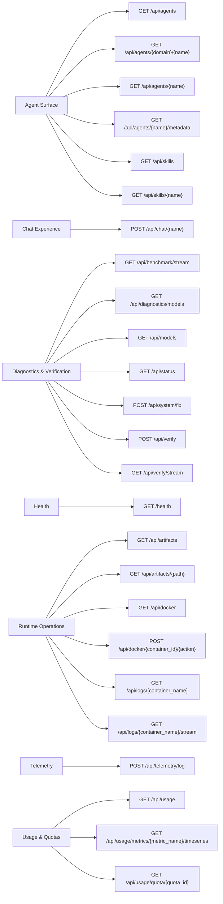

# Generated API Diagrams

> Generated from `dashboard_api.server.create_app().openapi()` by `scripts/generate_reference_docs.py`. Do not edit manually.

## Domain -> Endpoint Surface

## Domain Summary

| Domain | Operations | Methods |
| --- | ---: | --- |
| `Agent Surface` | 6 | `GET` |
| `Chat Experience` | 1 | `POST` |
| `Diagnostics & Verification` | 7 | `GET, POST` |
| `Health` | 1 | `GET` |
| `Runtime Operations` | 6 | `GET, POST` |
| `Telemetry` | 1 | `POST` |
| `Usage & Quotas` | 3 | `GET` |

## Operation Matrix

| Domain | Method | Path | Handler | Operation ID | Tags |
| --- | --- | --- | --- | --- | --- |
| `Agent Surface` | `GET` | `/api/agents` | `list_agents` | `list_agents_api_agents_get` | `-` |
| `Agent Surface` | `GET` | `/api/agents/{domain}/{name}` | `get_agent_config_legacy` | `get_agent_config_legacy_api_agents__domain___name__get` | `-` |
| `Agent Surface` | `GET` | `/api/agents/{name}` | `get_agent_config` | `get_agent_config_api_agents__name__get` | `-` |
| `Agent Surface` | `GET` | `/api/agents/{name}/metadata` | `get_agent_metadata` | `get_agent_metadata_api_agents__name__metadata_get` | `-` |
| `Agent Surface` | `GET` | `/api/skills` | `list_skills` | `list_skills_api_skills_get` | `-` |
| `Agent Surface` | `GET` | `/api/skills/{name}` | `get_skill_content` | `get_skill_content_api_skills__name__get` | `-` |
| `Chat Experience` | `POST` | `/api/chat/{name}` | `chat_with_agent` | `chat_with_agent_api_chat__name__post` | `-` |
| `Diagnostics & Verification` | `GET` | `/api/benchmark/stream` | `run_benchmark_stream` | `run_benchmark_stream_api_benchmark_stream_get` | `-` |
| `Diagnostics & Verification` | `GET` | `/api/diagnostics/models` | `diagnose_models` | `diagnose_models_api_diagnostics_models_get` | `-` |
| `Diagnostics & Verification` | `GET` | `/api/models` | `list_models` | `list_models_api_models_get` | `-` |
| `Diagnostics & Verification` | `GET` | `/api/status` | `get_status` | `get_status_api_status_get` | `-` |
| `Diagnostics & Verification` | `POST` | `/api/system/fix` | `run_system_fix` | `run_system_fix_api_system_fix_post` | `-` |
| `Diagnostics & Verification` | `POST` | `/api/verify` | `run_verification` | `run_verification_api_verify_post` | `-` |
| `Diagnostics & Verification` | `GET` | `/api/verify/stream` | `run_verification_stream` | `run_verification_stream_api_verify_stream_get` | `-` |
| `Health` | `GET` | `/health` | `health` | `health_health_get` | `-` |
| `Runtime Operations` | `GET` | `/api/artifacts` | `list_artifacts` | `list_artifacts_api_artifacts_get` | `-` |
| `Runtime Operations` | `GET` | `/api/artifacts/{path}` | `get_artifact` | `get_artifact_api_artifacts__path__get` | `-` |
| `Runtime Operations` | `GET` | `/api/docker` | `get_docker_stats` | `get_docker_stats_api_docker_get` | `-` |
| `Runtime Operations` | `POST` | `/api/docker/{container_id}/{action}` | `control_container` | `control_container_api_docker__container_id___action__post` | `-` |
| `Runtime Operations` | `GET` | `/api/logs/{container_name}` | `get_container_logs` | `get_container_logs_api_logs__container_name__get` | `-` |
| `Runtime Operations` | `GET` | `/api/logs/{container_name}/stream` | `stream_logs_sse` | `stream_logs_sse_api_logs__container_name__stream_get` | `-` |
| `Telemetry` | `POST` | `/api/telemetry/log` | `log_frontend_telemetry` | `log_frontend_telemetry_api_telemetry_log_post` | `-` |
| `Usage & Quotas` | `GET` | `/api/usage` | `get_usage` | `get_usage_api_usage_get` | `usage` |
| `Usage & Quotas` | `GET` | `/api/usage/metrics/{metric_name}/timeseries` | `get_metric_timeseries` | `get_metric_timeseries_api_usage_metrics__metric_name__timeseries_get` | `usage` |
| `Usage & Quotas` | `GET` | `/api/usage/quota/{quota_id}` | `get_quota_detail` | `get_quota_detail_api_usage_quota__quota_id__get` | `usage` |
