# Platform Guide (Consolidated)

**Last updated:** 2026-02-07

This is the canonical engineering guide for how the app is implemented, deployed, tested, and operated.

## 0. System at a Glance

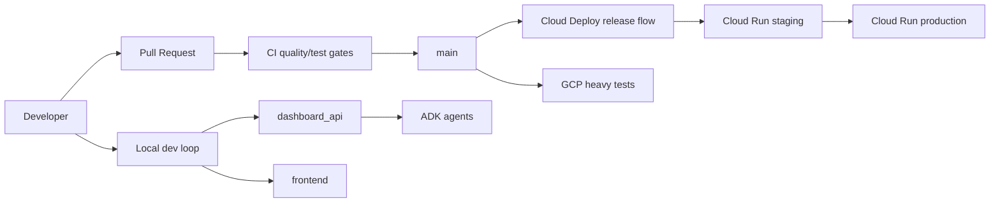

## 1. What Was Implemented (Latest Rollout)

Between commits `c6fde1d` and `583d1e9`, the platform was upgraded to a full CI/CD setup on GitHub + Google Cloud.

### Delivered

1. CI hardening
- `.github/workflows/ci.yml`
- Backend lint/type/tests + frontend lint/type/component/e2e
- Docker-stack e2e moved to manual dispatch (`run_docker_e2e`)

2. Cloud heavy-test lane
- `.github/workflows/gcp-heavy-tests.yml`
- `cloudbuild/heavy-tests.yaml`
- Scheduled + manual heavy tests in Cloud Build with optional eval stage

3. Progressive delivery on Cloud Deploy
- `.github/workflows/cd-cloud-deploy.yml`
- `cloudbuild/release-dashboard.yaml`
- `clouddeploy/pipeline.yaml`
- `clouddeploy/skaffold.yaml`
- `clouddeploy/service-staging.yaml`
- `clouddeploy/service-production.yaml`
- `dashboard_api/Dockerfile`

4. GCP bootstrap automation
- `infra/gcp/bootstrap.sh`, `infra/gcp/bootstrap.ps1`
- `infra/gcp/setup_wif.sh`, `infra/gcp/setup_wif.ps1`
- `infra/gcp/configure_github.sh`, `infra/gcp/configure_github.ps1`

5. Validation fixes applied during rollout
- Fixed Ruff + mypy gating issues in CI
- Added GCP IAM roles needed for Cloud Build submits (`serviceusage.serviceUsageConsumer`, `storage.admin`)
- Fixed backend test patch-order bug (`dashboard_api/tests/test_agents_router.py`)

6. Post-rollout simplification updates (2026-02-07)
- Reusable GCP workflow actions:
  - `.github/actions/gcp-auth-setup/action.yml`
  - `.github/actions/gcp-build-image/action.yml`
- Deployment workflows standardized:
  - `CD Cloud Deploy` remains the default release path
  - `CD Cloud Run Emergency` remains manual-dispatch fallback only
- Docs drift controls added:
  - `scripts/generate_reference_docs.py`
  - `docs/GENERATED_REFERENCE.md`
  - `docs/GENERATED_API_DIAGRAMS.md`
  - CI gate checks generated docs are current
- Cross-platform command single-source:
  - `scripts/command_catalog.json` defines command metadata for both wrappers
  - `scripts/render_command_help.py` renders both `make` and `make.ps1` help output
  - `scripts/validate_command_catalog_sync.py` enforces catalog parity in CI

### Rollout Timeline

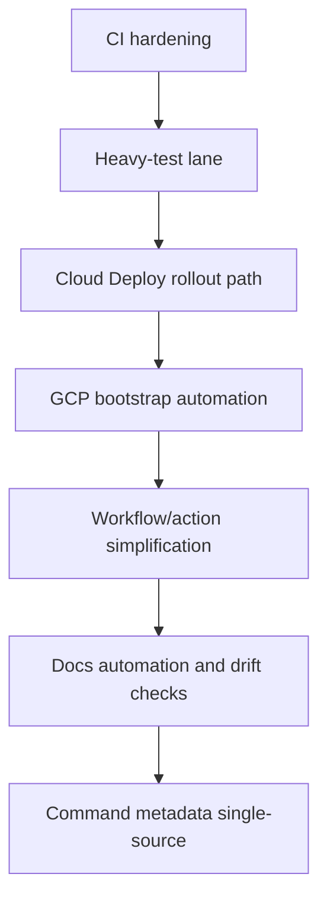

### Proven Pipeline Runs

- CI success: `21772460652`
- CD Cloud Deploy success (push/staging rollout): `21772460661`
- CD Cloud Deploy success (manual promote path): `21772284154`
- GCP Heavy Tests success: `21772461395`

## 2. Runtime Architecture

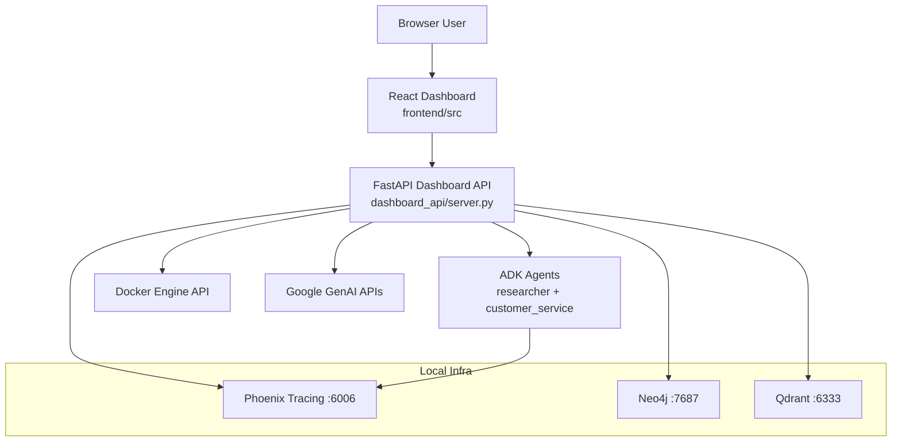

## 3. Request Lifecycles

### 3.1 Chat request lifecycle (streaming)

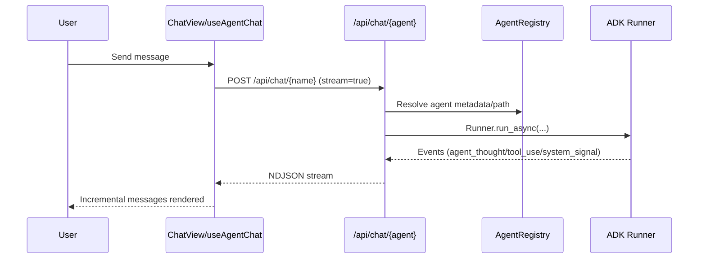

### 3.2 CI + CD lifecycle

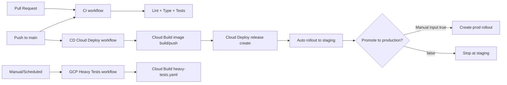

### 3.3 GitHub OIDC -> GCP WIF auth

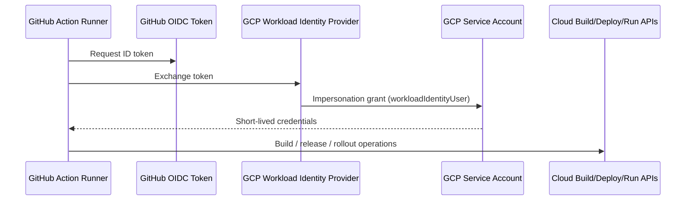

## 4. Deployment Topology (Cloud)

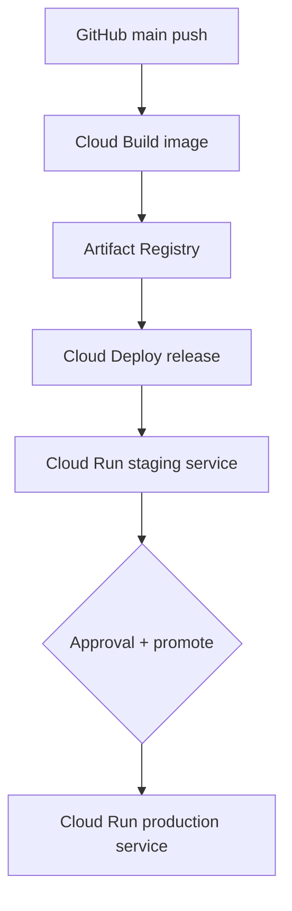

## 5. Canonical Runbooks

### 5.1 Local development

1. Install dependencies
- `make install`
- Windows: `.\make.ps1 install`

2. Start local infra
- `make dev-up`
- Windows: `.\make.ps1 dev-up`

3. Run API + UI
- `uv run python dashboard_api/server.py`
- `cd frontend && pnpm dev`

4. Verify
- `make dev-health`
- `make dev-verify`

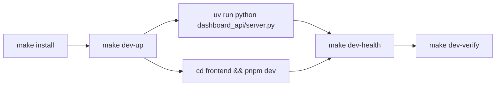

### 5.2 GCP bootstrap + CI/CD wiring

1. Bootstrap project resources
- `make gcp-bootstrap PROJECT=<project-id>`

2. Configure WIF
- `make gcp-setup-wif PROJECT=<project-id> REPO=<owner/repo>`

3. Configure GitHub vars/secrets
- `make gcp-configure-github PROJECT=<project-id> REPO=<owner/repo> WIF_PROVIDER=<provider> SERVICE_ACCOUNT_EMAIL=<email>`

4. Validate in Actions
- Run `CI`
- Run `GCP Heavy Tests`
- Run `CD Cloud Deploy` (optional promote)

5. Keep generated references current
- `make docs-generate`
- `make docs-check`

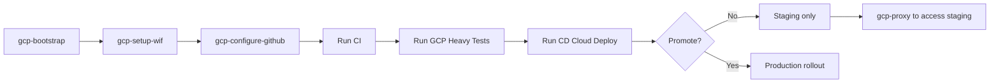

### 5.3 Accessing deployed services

Cloud Run services require authentication. Use the local proxy to access staging:

- `make gcp-proxy PROJECT=<project-id>`
- Windows: `.\make.ps1 gcp-proxy -Project <project-id>`

This opens a local proxy (default `http://localhost:8080`) forwarding to the staging service with your `gcloud` credentials.

## 6. Required GitHub Variables and Secrets

### Variables
- `GCP_PROJECT_ID`
- `GCP_REGION`
- `ARTIFACT_REGISTRY_HOSTNAME`
- `ARTIFACT_REGISTRY_REPOSITORY`
- `CLOUD_RUN_IMAGE_NAME`
- `CLOUD_DEPLOY_PIPELINE`
- `CLOUD_RUN_SERVICE_STAGING`
- `CLOUD_RUN_SERVICE_PRODUCTION`

### Secrets
- `GCP_WORKLOAD_IDENTITY_PROVIDER`
- `GCP_SERVICE_ACCOUNT`
- `GEMINI_API_KEY` (optional for certain checks)

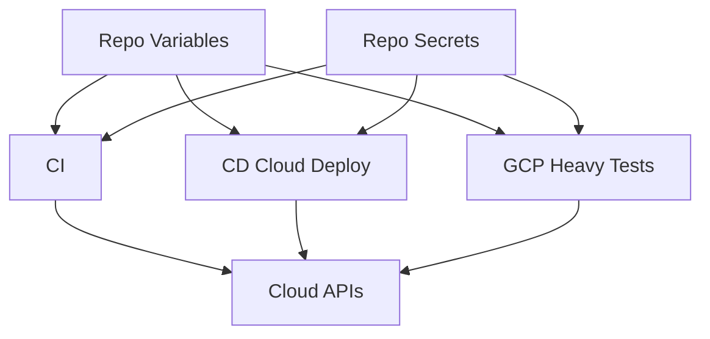

## 7. Current CI/CD Decision Model

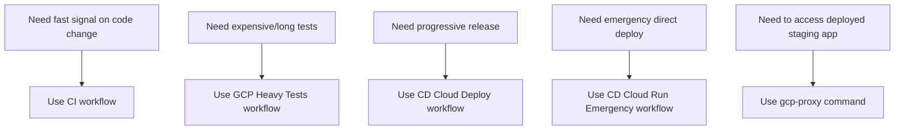

## 8. Consolidated Documentation Map

This guide plus the product guide replace duplicated details spread across:
- `docs/compat/ARCHITECTURE.md`
- `docs/compat/DEVELOPMENT.md`
- `docs/compat/OPERATIONS.md`
- `docs/compat/DEPLOYMENT.md`
- `docs/compat/CICD_GCP_CREDITS.md`
- `docs/compat/COMMANDS.md`
- `docs/compat/TESTING.md`

Canonical references:
- Engineering and operations: `docs/PLATFORM_GUIDE.md`
- Product behavior and features: `docs/PRODUCT_FEATURES.md`
- Refactoring backlog: `docs/REFACTORING_SIMPLIFICATION.md`
- Generated command/API reference: `docs/GENERATED_REFERENCE.md`
- Generated API domain diagrams: `docs/GENERATED_API_DIAGRAMS.md`
- Diagram-first index: `docs/DIAGRAMS.md`
