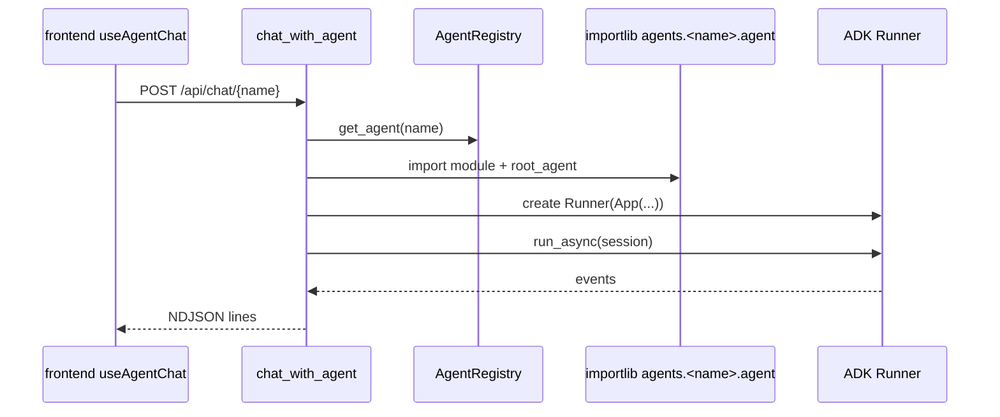
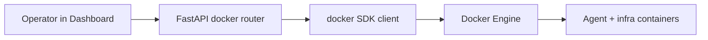
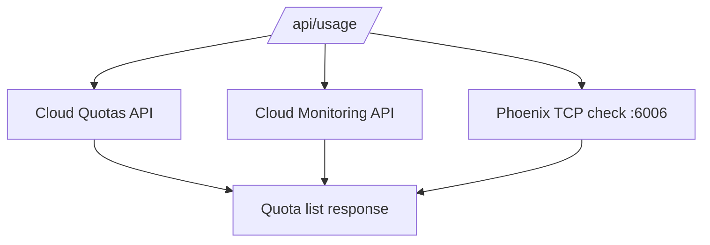
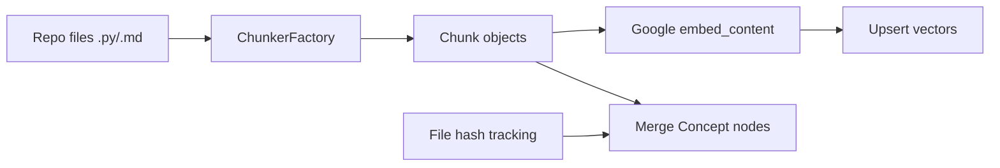
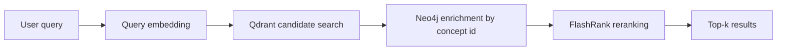
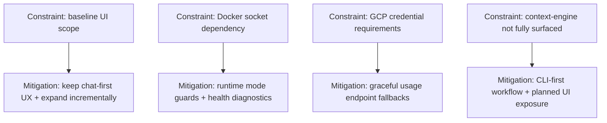
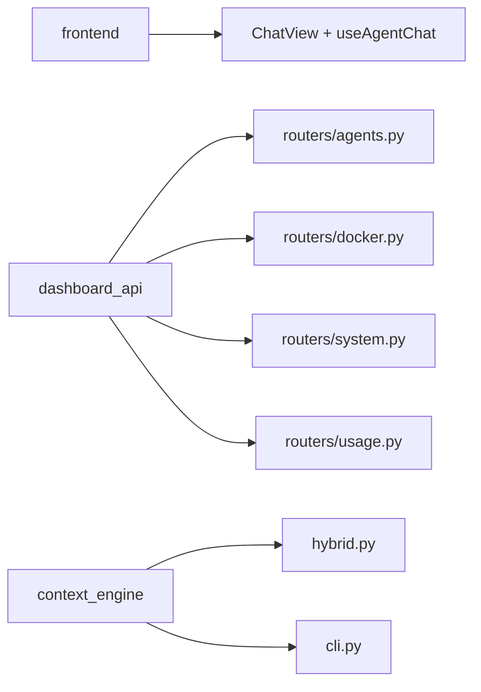

# Product Features Guide (Consolidated)

**Last updated:** 2026-02-07

This is the canonical product-facing guide for what the app does and how features behave end-to-end.

## 1. Product Scope

Antigravity currently ships a **chat-first dashboard** with supporting operational APIs.

### Core user outcomes

1. Chat with specialist agents (Researcher, Customer Service)
2. See streaming intermediate reasoning/tool output
3. Inspect and operate local Docker-based agent runtime
4. Run verification and diagnostics endpoints
5. (Engineering users) Run context-engine ingestion/search workflows

## 2. Capability Map

```mermaid
graph TD
    Product[Antigravity Dashboard]

    Product --> Chat[Agent Chat]
    Product --> Ops[Operations + Runtime]
    Product --> Diag[Diagnostics + Verification]
    Product --> Usage[Quota/Usage Visibility]
    Product --> Ctx[Context Engine]

    Chat --> Chat1[Streamed NDJSON events]
    Chat --> Chat2[Legacy JSON mode]

    Ops --> Ops1[Container list]
    Ops --> Ops2[Container actions start/stop/restart]
    Ops --> Ops3[Snapshot and SSE logs]

    Diag --> Diag1[System status]
    Diag --> Diag2[Verification run + stream]
    Diag --> Diag3[Model catalog + diagnostics]

    Usage --> Usage1[Quota listing]
    Usage --> Usage2[Metric descriptors]
    Usage --> Usage3[Timeseries endpoint]

    Ctx --> Ctx1[Chunk + embed + index]
    Ctx --> Ctx2[Hybrid search + rerank]
    Ctx --> Ctx3[Repo analysis with cache]
```



### Feature Domain -> API Surface

```mermaid
flowchart LR
    Chat[Chat domain] --> ChatAPI[/api/chat/*]
    Ops[Ops domain] --> OpsAPI[/api/docker/* + /api/logs/*]
    Verify[Verification domain] --> VerifyAPI[/api/status + /api/verify*]
    Usage[Usage domain] --> UsageAPI[/api/usage*]
    AgentMeta[Agent metadata domain] --> AgentsAPI[/api/agents* + /api/skills*]
```

## 3. Frontend UX (Current Baseline)

Main UX is implemented in:
- `frontend/src/App.tsx`
- `frontend/src/components/ChatView.tsx`
- `frontend/src/components/chat/useAgentChat.ts`

### Baseline interaction

```mermaid
flowchart LR
    A[Select agent] --> B[Type message]
    B --> C[POST /api/chat/{agent}]
    C --> D[Receive NDJSON stream]
    D --> E[Render agent_thought/tool_use/system_signal rows]
```

## 4. Chat Feature Detail

### API contract

- Endpoint: `POST /api/chat/{name}` (`dashboard_api/routers/agents.py`)
- Request model: `MessageRequest` (`message`, `session_id`)
- Default response mode: streaming NDJSON (`application/x-ndjson`)
- Optional mode: `?stream=false` returns `{"response": "..."}`

### Event types shown to UI

- `agent_thought`
- `tool_use`
- `system_signal`

### Chat execution internals



## 5. Runtime Operations Features

Operational endpoints are defined in:
- `dashboard_api/routers/docker.py`
- `dashboard_api/routers/system.py`

### Docker operations

- `GET /api/docker` (container list)
- `POST /api/docker/{container_id}/{action}`
- `GET /api/logs/{container_name}`
- `GET /api/logs/{container_name}/stream` (SSE)



### System and verification

- `GET /api/status`
- `POST /api/verify`
- `GET /api/verify/stream`
- `GET /api/models`
- `GET /api/diagnostics/models`
- `POST /api/system/fix`

## 6. Usage and Quota Visibility Features

Endpoints in `dashboard_api/routers/usage.py`:

- `GET /api/usage`
- `GET /api/usage/quota/{quota_id}`
- `GET /api/usage/metrics/{metric_name}/timeseries`



## 7. Context Engine Features

Key modules:
- `agent_platform/context_engine/chunker.py`
- `agent_platform/context_engine/hybrid.py`
- `agent_platform/context_engine/vector.py`
- `agent_platform/context_engine/graph.py`
- `agent_platform/context_engine/rerank.py`
- `agent_platform/context_engine/google_client.py`
- `agent_platform/context_engine/cli.py`

### Ingestion flow



### Retrieval flow



### CLI feature set

- `init`, `add`, `search`, `wipe`, `ingest`, `stats`, `analyze`

## 8. Product Constraints (Current)

1. UI is intentionally baseline and chat-focused (not full control-plane UI yet)
2. Docker-management endpoints require reachable Docker socket
3. Some usage endpoints are GCP-specific and expect appropriate credentials
4. Context engine is powerful but still an engineering-facing subsystem, not fully surfaced in UI



## 9. Feature-to-Code Matrix

| Feature | Primary frontend/backend files |
| :--- | :--- |
| Agent chat streaming | `frontend/src/components/chat/useAgentChat.ts`, `dashboard_api/routers/agents.py` |
| Agent selection UX | `frontend/src/components/ChatView.tsx`, `frontend/src/components/chat/constants.ts` |
| Docker operations | `dashboard_api/routers/docker.py`, `dashboard_api/utils/docker_utils.py` |
| System diagnostics | `dashboard_api/routers/system.py` |
| Quota and usage APIs | `dashboard_api/routers/usage.py` |
| Context engine ingest/search | `agent_platform/context_engine/hybrid.py`, `agent_platform/context_engine/cli.py` |



## 10. Relationship to Other Docs

Use this file for feature understanding.

Use `docs/PLATFORM_GUIDE.md` for:
- CI/CD
- Deployment
- GCP setup
- Runbooks/operations

Use `docs/REFACTORING_SIMPLIFICATION.md` for prioritized simplification work identified from this documentation pass.
