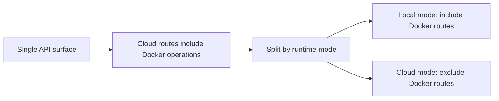
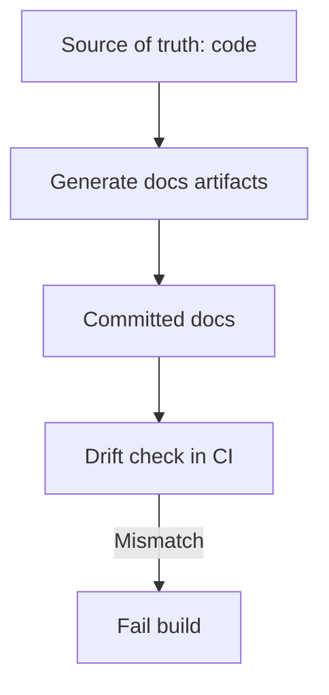

# Refactoring and Simplification Backlog

**Last updated:** 2026-02-07

This backlog was produced during the documentation consolidation pass and focuses on reducing complexity without losing capability.

## Prioritization Framework

- **Impact**: Reliability, maintainability, or developer velocity gain
- **Effort**: Estimated implementation effort
- **Priority**: P0 (immediate), P1 (next), P2 (later)

## 1. Highest Value Items

| ID | Priority | Impact | Effort | Status | Refactor |
| :--- | :--- | :--- | :--- | :--- | :--- |
| R-001 | P0 | High | Low | Completed (2026-02-07) | Unify type-check scope across Makefile and CI |
| R-002 | P0 | High | Low | Completed (2026-02-07) | Parameterize hard-coded GCP project/service in usage router |
| R-003 | P0 | High | Medium | Completed (2026-02-07) | Split Docker-dependent API from cloud-safe API surface |
| R-004 | P1 | High | Medium | Completed (2026-02-07) | Consolidate CI/CD workflow duplication (Cloud Deploy vs Cloud Run fallback) |
| R-005 | P1 | Medium | Medium | Completed (2026-02-07) | Make context-engine data objects typed and immutable where possible |
| R-006 | P1 | Medium | Medium | Completed (2026-02-07) | Stop in-place document mutation in reranker |
| R-007 | P1 | Medium | Medium | Completed (2026-02-07) | Generate docs from source-of-truth commands/endpoints |
| R-008 | P2 | Medium | High | Planned | Single-source command definitions for `Makefile` and `make.ps1` |

## 2. Detailed Work Items

### R-001: Unify type-check policy

Problem:
- CI runs `mypy dashboard_api` (`.github/workflows/ci.yml`)
- Local commands run `mypy .` (`Makefile`, `make.ps1`)

Action:
1. Pick one policy (recommended: tiered checks)
2. Add explicit targets:
- `type-check-fast` (CI default)
- `type-check-full` (nightly/manual)
3. Update docs and developer expectations

### R-002: Remove hard-coded project constants in usage router

Problem:
- `dashboard_api/routers/usage.py` hard-codes `PROJECT_ID` and `SERVICE`

Action:
1. Move to env-driven config (`agent_platform/config.py`)
2. Fail gracefully when values are missing
3. Add tests for config fallback behavior

### R-003: Cloud-safe API boundary

Problem:
- Single API app includes both cloud-friendly and Docker-local routes

Action:
1. Split router mounts by runtime mode (`ENV`)
2. Keep `/health` and agent chat universally available
3. Gate Docker routes behind local mode only

### R-004: CI/CD workflow simplification

Problem:
- Two deployment workflows exist (`cd-cloud-deploy.yml`, `cd-cloud-run.yml`) with overlap

Action:
1. Make Cloud Deploy the default only path
2. Keep Cloud Run direct deploy as documented emergency workflow
3. Extract shared auth/build steps into reusable action

### R-005: Typed context chunk model

Problem:
- `Chunk` subclasses `dict` and duplicates attribute state (`chunker.py`)

Action:
1. Replace with `@dataclass(frozen=True)` or Pydantic model
2. Add serialization helpers at boundaries
3. Update chunker + CLI usage

### R-006: Reranker side effects

Problem:
- Reranker mutates original docs by attaching `rerank_score`

Action:
1. Return copied payloads with score
2. Keep original candidate objects immutable
3. Add unit tests for no-mutation guarantee

### R-007: Docs generation and drift control

Problem:
- Commands/docs drift due to manual duplication

Action:
1. Generate command reference from `make help` and `.\make.ps1 help`
2. Generate endpoint table from FastAPI OpenAPI
3. Add a CI check to fail on stale generated docs

### R-008: Cross-platform command single-source

Problem:
- `Makefile` and `make.ps1` duplicate many command definitions

Action:
1. Define shared command metadata (YAML/JSON)
2. Generate both command wrappers
3. Keep hand-written escape hatch targets minimal

## 3. Suggested Execution Plan

### Phase A (1-2 days)
1. R-001
2. R-002
3. R-006

### Phase B (2-4 days)
1. R-003
2. R-004
3. R-007

### Phase C (longer)
1. R-005
2. R-008

## 4. Success Metrics

- Fewer doc contradictions between local and CI behavior
- Reduced cloud-runtime incidents caused by Docker-only endpoints
- Lower maintenance overhead for command/docs updates
- Better testability and fewer side effects in context engine pipeline
