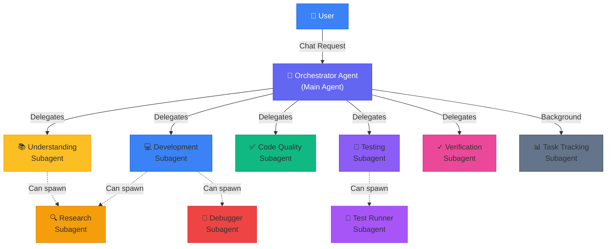
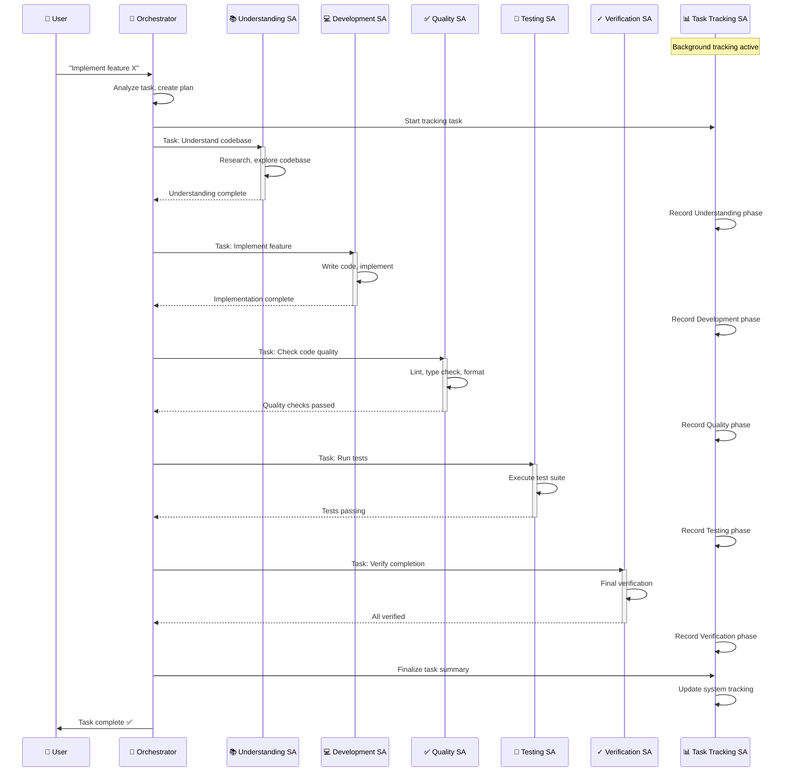
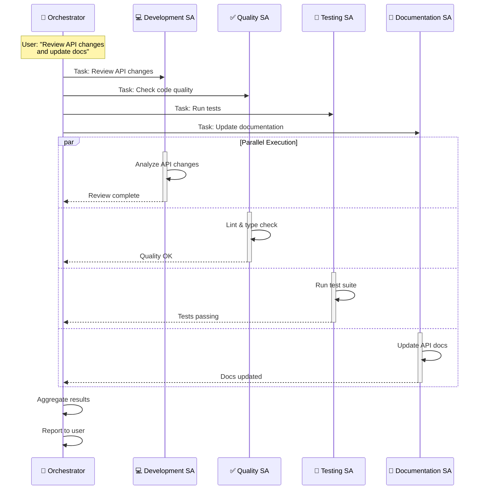
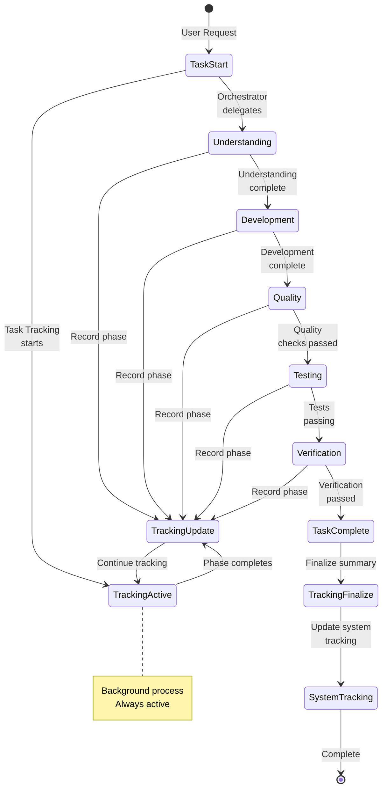
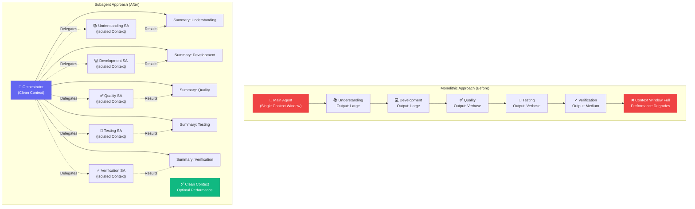
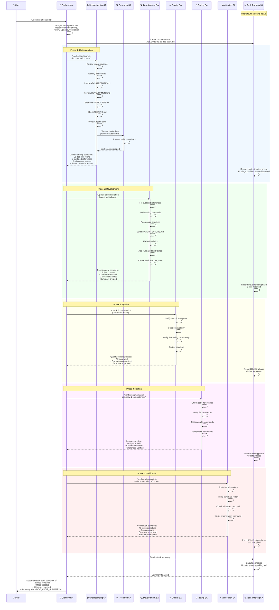

# Subagent System Guide

> **Last Updated**: 2026-01-26  
> **Status**: Comprehensive Reference Guide

## Table of Contents

1. [System Overview](#system-overview)
2. [Agent Details](#agent-details)
3. [Operational Tracking](#operational-tracking)
4. [Architecture Diagrams](#architecture-diagrams)
5. [Case Study: Documentation Audit](#case-study-documentation-audit)

---

## System Overview

The subagent system is a sophisticated orchestration architecture built on Cursor IDE's subagent capabilities. Instead of a monolithic agent handling all development tasks, the system uses an **Orchestrator Pattern** where a main agent delegates work to specialized subagents.

### Core Concept

When a user requests work, the **Orchestrator** agent:
1. Analyzes the incoming task
2. Breaks it down into appropriate phases
3. Delegates each phase to specialized subagents
4. Coordinates handoffs between phases
5. Aggregates results and reports back to the user

### Key Benefits

| Benefit | Description |
|---------|-------------|
| **Context Isolation** | Each subagent operates in its own isolated context window, preventing context bloat from intermediate outputs |
| **Parallel Execution** | Independent tasks can run simultaneously across multiple subagents |
| **Specialized Expertise** | Each subagent focuses on a single domain, leading to better results |
| **Reusability** | Subagents can be used across different projects and tasks |
| **Nested Delegation** | Subagents can spawn their own subagents for complex scenarios |
| **Cost Efficiency** | Fast models handle simple tasks, powerful models handle complex work |

### System Architecture

The system consists of **10 specialized agents**:

**Phase Agents** (5):
- Understanding
- Development
- Code Quality
- Testing
- Verification

**Support Agents** (5):
- Orchestrator (main coordinator)
- Task Tracking (background)
- Research (nested)
- Debugger (nested)
- Test Runner (nested)

---

## Agent Details

### 1. Orchestrator Agent

**Location**: `.cursor/agents/orchestrator.md`  
**Model**: `inherit` (uses user's configured model)  
**Mode**: Foreground  
**Role**: Main coordinator that delegates ALL work

#### Purpose

The Orchestrator is the entry point for all tasks. It never performs work directly—instead, it analyzes tasks, creates execution plans, and delegates to specialized subagents.

#### Key Capabilities

- **Task Analysis**: Understands incoming requests and determines required phases
- **Phase Planning**: Breaks work into sequential or parallel phases
- **Delegation Management**: Routes tasks to appropriate subagents
- **Result Aggregation**: Collects and summarizes subagent outputs
- **Progress Coordination**: Manages handoffs between phases

#### Delegation Strategy

**Phase-Based Delegation**:
- Understanding phase → `understanding` subagent
- Development phase → `development` subagent
- Quality phase → `code-quality` subagent
- Testing phase → `testing` subagent
- Verification phase → `verification` subagent
- Task tracking → `task-tracking` subagent (throughout, background)

**Execution Patterns**:
- **Sequential**: For dependent phases (Understanding → Development → Quality → Testing → Verification)
- **Parallel**: For independent tasks (Quality + Testing + Documentation simultaneously)
- **Conditional**: Skips phases when not needed (e.g., skip verification for docs-only changes)

#### Key Principles

1. **Never do the work yourself** - Always delegate to specialized subagents
2. **Trust subagent expertise** - Let them handle their domain
3. **Coordinate, don't micromanage** - Provide clear tasks and let subagents execute
4. **Aggregate intelligently** - Summarize subagent outputs for the user
5. **Track progress** - Use task-tracking subagent throughout

---

### 2. Understanding Subagent

**Location**: `.cursor/agents/understanding.md`  
**Model**: `fast` (optimized for speed)  
**Mode**: Foreground  
**Role**: Codebase exploration and research specialist

#### Purpose

The Understanding subagent explores the codebase to understand current state, identifies implementation approaches, and documents findings for subsequent phases.

#### Key Capabilities

- **Codebase Exploration**: Discovers relevant files, modules, and architecture
- **Pattern Research**: Finds established patterns and conventions
- **Dependency Analysis**: Identifies integration points and related features
- **Best Practices Research**: Researches technology stack best practices
- **Documentation Creation**: Creates understanding documents for next phases

#### Process

1. **Current State Discovery**:
   - Reviews documentation in `docs/` (ARCHITECTURE, DEVELOPMENT, STANDARDS, TESTING)
   - Explores codebase using semantic search
   - Understands component interactions and data flow
   - Reviews `.agent/issues.md` and `.agent/system-tracking.md` for context

2. **Implementation Research**:
   - Researches best practices for technology stack
   - Reviews codebase patterns and similar implementations
   - Identifies security considerations
   - Finds edge cases and error handling patterns

3. **Document Findings**:
   - Current state analysis
   - Implementation approach recommendations
   - Patterns to follow
   - Dependencies identified
   - Security considerations
   - Edge cases identified

#### When to Delegate

Delegates to `research` subagent for:
- Complex technical research
- External API documentation deep dives
- Architecture pattern comparisons

#### Exit Criteria

- ✅ Current state understood (what exists)
- ✅ Implementation approach clear (how to do it)
- ✅ Best practices and patterns identified
- ✅ Ready for development phase

---

### 3. Development Subagent

**Location**: `.cursor/agents/development.md`  
**Model**: `inherit` (uses user's configured model)  
**Mode**: Foreground  
**Role**: Code implementation specialist

#### Purpose

The Development subagent implements features and writes code using Test-Driven Development (TDD) principles, following established patterns and conventions.

#### Key Capabilities

- **Implementation Planning**: Designs structure, interfaces, APIs, and data flow
- **TDD Execution**: Follows Red-Green-Refactor cycle
- **Code Writing**: Produces clean, maintainable code
- **Edge Case Handling**: Addresses error scenarios, validation, and security
- **Documentation Updates**: Updates code comments, docstrings, and API docs

#### Process

1. **Plan Implementation**:
   - Updates documentation first (source of truth)
   - Designs component structure and interfaces
   - Defines test cases for all layers (Unit → Agent → Integration → Component → E2E)
   - Creates implementation checklist

2. **Implement Using TDD**:
   - **🔴 Red Phase**: Write failing tests
   - **🟢 Green Phase**: Write minimal code to pass tests
   - **🔵 Refactor Phase**: Improve code while keeping tests green

3. **Follow Code Standards**:
   - Reviews `docs/STANDARDS.md`
   - Follows Python/TypeScript conventions
   - Uses established patterns from codebase

4. **Update Documentation**:
   - Code comments and docstrings
   - README files if needed
   - API documentation if interfaces change

#### When to Delegate

- **`debugger` subagent**: For runtime errors, test failures, complex debugging
- **`research` subagent**: For technical implementation questions, API usage patterns

#### Exit Criteria

- ✅ Implementation plan complete
- ✅ All test cases written and passing
- ✅ All functionality implemented
- ✅ Code refactored and clean
- ✅ Code follows all standards
- ✅ Documentation updated
- ✅ Ready for code quality phase

---

### 4. Code Quality Subagent

**Location**: `.cursor/agents/code-quality.md`  
**Model**: `fast` (optimized for speed)  
**Mode**: Foreground  
**Role**: Code quality assurance specialist

#### Purpose

The Code Quality subagent ensures all code meets quality standards through linting, type checking, formatting verification, and security review.

#### Key Capabilities

- **Linting**: Runs Ruff (Python) and ESLint (TypeScript/JavaScript)
- **Type Checking**: Performs mypy (Python) and TypeScript compiler checks
- **Formatting Verification**: Ensures consistent code style
- **Security Review**: Checks for vulnerabilities and input validation issues
- **Build Verification**: Ensures clean builds without warnings

#### Process

1. **Linting**:
   ```bash
   make lint                    # Backend: ruff check + format
   make frontend-lint          # Frontend: ESLint
   ```
   **Requires**: No errors, no warnings, code formatted

2. **Type Checking**:
   ```bash
   make type-check              # All type checks (backend + frontend)
   ```
   **Requires**: No type errors or warnings

3. **Security Review**:
   - Reviews code for vulnerabilities
   - Checks dependency versions
   - Verifies input validation
   - Reviews error handling (no info leakage)

4. **Build Verification**:
   ```bash
   uv sync --dev               # Backend (check for warnings)
   make frontend-build         # Frontend (check for warnings)
   make dev-build              # Docker (check for warnings)
   ```
   **Requires**: All builds clean, no warnings

#### Output

Quality report with:
- Linting results
- Type checking results
- Formatting status
- Security review findings
- Build verification results
- Issues found (if any)

#### Exit Criteria

- ✅ All linting passes (no errors, no warnings)
- ✅ All type checking passes
- ✅ Security review complete
- ✅ All builds clean (no warnings)
- ✅ Ready for testing phase

---

### 5. Testing Subagent

**Location**: `.cursor/agents/testing.md`  
**Model**: `fast` (optimized for speed)  
**Mode**: Foreground  
**Role**: Test execution and analysis specialist

#### Purpose

The Testing subagent executes test suites across all layers, analyzes failures, fixes issues while preserving test intent, and writes new tests when needed.

#### Key Capabilities

- **Test Identification**: Determines which test layers to run
- **Test Execution**: Runs all appropriate test suites
- **Failure Analysis**: Understands why tests fail
- **Test Fixing**: Preserves test intent while fixing issues
- **Test Writing**: Creates new tests for new functionality

#### Test Layers (5-layer pyramid)

1. **Layer 1: Unit Tests** - Colocated (`test_*.py`)
2. **Layer 2: Agent Structure Tests** - `agents/<agent>/tests/`
3. **Layer 3: Integration Tests** - Service boundaries
4. **Layer 4: Component Tests** - Frontend components
5. **Layer 5: E2E Tests** - Full system

#### Process

1. **Prepare Environment**:
   ```bash
   make dev-up                 # Start Docker stack
   make dev-health             # Verify services healthy
   ```

2. **Run Tests by Layer**:
   - **Layer 1**: `make test-fast` (unit tests)
   - **Layer 2**: `make test-agent AGENT=agent_name` (agent tests)
   - **Layer 3**: `make test-pytest` (integration tests)
   - **Layer 4**: `make frontend-test` (component tests)
   - **Layer 5**: `make frontend-e2e-docker` (E2E tests)

3. **Review Logs**:
   ```bash
   make dev-logs-recent        # Recent Docker logs
   make dev-logs-service SERVICE=phoenix  # Specific service
   ```

4. **Failure Analysis**:
   - Reviews logs to understand failure
   - Checks if failure indicates wider architectural issue
   - If wider issue: Documents in `.agent/issues.md`, plans refactor
   - If isolated issue: Fixes and retries

#### When to Delegate

Delegates to `test-runner` subagent for:
- Complex test failures
- Flaky test investigation
- Test performance issues

#### Exit Criteria

- ✅ All test layers pass
- ✅ Logs reviewed and clean
- ✅ Any issues identified and addressed
- ✅ Ready for verification phase

---

### 6. Verification Subagent

**Location**: `.cursor/agents/verification.md`  
**Model**: `fast` (optimized for speed)  
**Mode**: Foreground  
**Role**: Skeptical validator

#### Purpose

The Verification subagent validates that completed work actually functions as claimed. It takes a skeptical approach and tests everything thoroughly.

#### Key Capabilities

- **Environment Reset**: Ensures clean, reproducible environment
- **Service Verification**: Confirms all services are healthy
- **E2E Testing**: Runs end-to-end tests in deployed environment
- **Log Analysis**: Reviews logs for errors and warnings
- **Functional Validation**: Tests actual functionality, not just code existence

#### Process

1. **Reset Environment**:
   ```bash
   make dev-reset              # Full reset (stops, removes volumes, rebuilds, starts)
   ```

2. **Verify Services**:
   ```bash
   make dev-health             # Check all services healthy
   docker compose ps           # View container status
   ```

3. **Start API and Frontend**:
   - **Terminal 1 - API**: `uv run python dashboard_api/server.py`
   - **Terminal 2 - Frontend**: `cd frontend && pnpm dev`

4. **Run E2E Tests**:
   ```bash
   make frontend-e2e-docker
   ```

5. **Verify Logs**:
   ```bash
   make dev-logs-recent        # Docker logs
   # Check API and frontend server terminals
   ```

6. **Final Check**:
   ```bash
   make dev-verify             # Complete verification (lint, build, test, e2e)
   ```

#### Approach

**Be Thorough and Skeptical**:
- Do not accept claims at face value
- Test everything
- Identify what was claimed to be completed
- Check that implementation exists and is functional
- Run relevant tests or verification steps
- Look for edge cases that may have been missed
- Verify documentation is updated

#### Output

Verification report with:
- What was verified and passed
- What was claimed but incomplete or broken
- Specific issues that need to be addressed
- Final status (Success / Partial / Failure)

#### Exit Criteria

- ✅ Environment reset and clean
- ✅ All services running and healthy
- ✅ All E2E tests passing
- ✅ All logs clean
- ✅ System fully operational
- ✅ Task summary complete
- ✅ System tracking updated

---

### 7. Task Tracking Subagent

**Location**: `.cursor/agents/task-tracking.md`  
**Model**: `fast` (optimized for speed)  
**Mode**: Background (always active)  
**Role**: Progress tracking specialist

#### Purpose

The Task Tracking subagent maintains comprehensive task execution summaries, tracking all work, decisions, phase transitions, and issues throughout the development lifecycle.

#### Key Capabilities

- **Task Summary Creation**: Creates and maintains task summaries in `.agent/tasks/`
- **Decision Tracking**: Records decisions made during work
- **Phase Transition Recording**: Documents when/why moving between phases
- **Issue Documentation**: Records issues encountered
- **Context Management**: Tracks context size and complexity

#### Always Active

**Always active in background** during all phases. Runs continuously to track progress.

#### Process

**At Task Start**:
1. Create task summary from `.agent/TASK_EXECUTION_TEMPLATE.md`
2. Fill in task overview section
3. Record start time
4. Note initial context state

**During Work**:
- **Decisions** (record immediately in compact format):
  - **Phase**: [Phase] | **Options**: [List] | **Decision**: [Chosen] | **Rationale**: [Why] | **Result**: [Outcome]

- **Phase Transitions** (record immediately):
  - **From/To**: [Phase transitions] | **Trigger**: [What caused] | **Context**: [What maintained]

- **Issues** (record immediately):
  - **Phase**: [Phase] | **Status**: [Open/Resolved/Deferred]
  - **Description**: [What happened] | **Resolution**: [How fixed] | **Time**: [Duration]

- **Context Management** (update periodically):
  - **Initial/Final**: [Size/complexity] | **Growth**: [How it grew]
  - **Carried**: [What kept] | **Discarded**: [What removed and why]

**At Phase Completion**:
1. Fill in phase section in compact format:
   - **Status**: [Started/Completed/Skipped] | **Duration**: [Time]
   - **Actions**: [List]
   - **Findings**: [Key findings]
   - **Files**: [Created/Modified]
   - **Issues**: [None/List]
2. Mark phase as "Completed"
3. Note context state at phase end

**At Task Completion**:
1. Complete all remaining sections:
   - Metrics (calculate totals)
   - Lessons learned
   - Remaining work
   - Final status
2. Update `.agent/system-tracking.md` with entry
3. Link task summary in system tracking

#### Output

Updated task summary files in `.agent/tasks/` with:
- Complete task execution history
- All decisions documented
- All phase transitions tracked
- All issues recorded
- Context management tracked
- Final metrics and lessons learned

---

### 8. Research Subagent

**Location**: `.cursor/agents/research.md`  
**Model**: `fast` (optimized for speed)  
**Mode**: Foreground  
**Role**: Deep research specialist

#### Purpose

The Research subagent conducts deep codebase exploration and external research when Understanding or Development subagents need detailed research beyond their scope.

#### Key Capabilities

- **Deep Codebase Exploration**: Finds all relevant code, patterns, and examples
- **External Best Practices Research**: Researches technology stack, frameworks, libraries
- **Pattern Analysis**: Finds similar implementations and established patterns
- **Documentation Research**: Reviews external API documentation and guides
- **Recommendation Generation**: Provides clear, actionable recommendations

#### Process

1. **Codebase Exploration**:
   - Searches for related code and patterns
   - Finds similar implementations
   - Identifies established conventions
   - Reviews architecture documentation

2. **External Research**:
   - Researches best practices for technology stack
   - Finds external examples and patterns
   - Reviews API documentation
   - Researches security considerations

3. **Pattern Analysis**:
   - Compares different approaches
   - Identifies pros and cons
   - Recommends best approach
   - Documents trade-offs

4. **Document Findings**:
   - Findings and recommendations
   - Code examples and patterns
   - Best practices identified
   - Security considerations
   - Trade-offs and alternatives

#### Output

Research document with:
- Findings and recommendations
- Code examples and patterns
- Best practices identified
- Security considerations
- Trade-offs and alternatives

#### Exit Criteria

- ✅ Research complete
- ✅ Findings documented
- ✅ Recommendations clear
- ✅ Ready for implementation

---

### 9. Debugger Subagent

**Location**: `.cursor/agents/debugger.md`  
**Model**: `inherit` (uses user's configured model)  
**Mode**: Foreground  
**Role**: Root cause analysis specialist

#### Purpose

The Debugger subagent specializes in root cause analysis for errors and test failures, implementing minimal fixes that resolve underlying issues.

#### Key Capabilities

- **Error Capture**: Captures error messages, stack traces, and environment details
- **Reproduction Identification**: Identifies minimal steps to reproduce
- **Failure Isolation**: Traces through code execution to find exact failure point
- **Root Cause Analysis**: Analyzes why failure occurs and identifies underlying issue
- **Minimal Fix Implementation**: Fixes root cause, not symptoms
- **Solution Verification**: Tests fix resolves issue without regressions

#### Process

1. **Capture Error Information**:
   - Error message and stack trace
   - Reproduction steps
   - Environment details
   - Related code context

2. **Identify Reproduction Steps**:
   - Minimal steps to reproduce
   - Required environment setup
   - Dependencies needed

3. **Isolate the Failure Location**:
   - Traces through code execution
   - Identifies exact failure point
   - Understands data flow
   - Checks state at failure

4. **Root Cause Analysis**:
   - Analyzes why failure occurs
   - Identifies underlying issue
   - Considers edge cases
   - Checks for related issues

5. **Implement Minimal Fix**:
   - Fixes root cause, not symptoms
   - Minimal change to resolve issue
   - Preserves existing functionality
   - Maintains code quality

6. **Verify Solution Works**:
   - Tests fix resolves issue
   - Verifies no regressions
   - Checks edge cases
   - Confirms tests pass

#### Output

Debug report with:
- Root cause explanation
- Evidence supporting diagnosis
- Specific code fix
- Testing approach
- Verification results

#### Exit Criteria

- ✅ Root cause identified
- ✅ Fix implemented
- ✅ Solution verified
- ✅ No regressions
- ✅ Ready to continue development

---

### 10. Test Runner Subagent

**Location**: `.cursor/agents/test-runner.md`  
**Model**: `fast` (optimized for speed)  
**Mode**: Foreground  
**Role**: Test automation expert

#### Purpose

The Test Runner subagent proactively runs tests when code changes are detected, analyzes failures, and fixes issues while preserving test intent.

#### Key Capabilities

- **Proactive Testing**: Automatically runs tests when code changes are detected
- **Test Identification**: Determines which test layers are affected
- **Test Execution**: Runs appropriate test suites
- **Failure Analysis**: Analyzes failure output to identify root cause
- **Test Fixing**: Fixes issues while preserving test intent

#### Process

1. **Identify Relevant Tests**:
   - Determines which test layers are affected
   - Finds related test files
   - Checks test coverage

2. **Run Tests**:
   ```bash
   make test-fast              # Unit tests (skip evals)
   make test-agent AGENT=name  # Agent tests
   make test-pytest            # Integration tests (pytest)
   make frontend-test          # Component tests
   make frontend-e2e-docker    # E2E tests
   ```

3. **Analyze Failures**:
   - If tests fail:
     1. Analyzes the failure output
     2. Identifies the root cause
     3. Fixes the issue while preserving test intent
     4. Re-runs to verify

4. **Fix Test Issues**:
   - **Preserve test intent**:
     - Don't weaken tests to make them pass
     - Fix implementation, not tests (unless test is wrong)
     - Maintain test coverage
     - Ensure tests are meaningful

#### Output

Test results with:
- Number of tests passed/failed
- Summary of any failures
- Changes made to fix issues
- Verification that tests pass

#### Exit Criteria

- ✅ All relevant tests run
- ✅ All tests passing
- ✅ Test failures fixed (preserving intent)
- ✅ Test coverage maintained

---

## Operational Tracking

### Task Execution Tracking

The system maintains comprehensive tracking of all work through two primary mechanisms:

1. **Task Summaries** (`.agent/tasks/`): Detailed per-task execution records
2. **System Tracking** (`.agent/system-tracking.md`): High-level workflow runs and lessons learned

### Task Summary Structure

Task summaries are created from `.agent/TASK_EXECUTION_TEMPLATE.md` and include:

#### 📋 Overview Section
- **Request**: Original task description
- **Workflow**: Main workflow used
- **Phases**: Checkboxes for each phase (Understanding, Development, Quality, Testing, Verification)
- **Date**: Task start date
- **Duration**: Total time taken
- **Status**: In Progress/Success/Partial/Failure

#### 🎯 Decisions Section
Records all decisions made during work in compact format:
- **Phase**: Which phase the decision occurred in
- **Options**: List of options considered
- **Decision**: What was chosen
- **Rationale**: Why this decision was made
- **Result**: Outcome of the decision

#### 🔄 Workflow Execution Section
Phase-by-phase breakdown:
- **Status**: Started/Completed/Skipped
- **Duration**: Time taken for phase
- **Actions**: List of actions performed
- **Findings**: Key findings from phase
- **Files**: Files created/modified
- **Issues**: Issues encountered (if any)

#### 🐛 Issues Section
Detailed issue tracking:
- **Phase**: Which phase the issue occurred in
- **Status**: Open/Resolved/Deferred
- **Description**: What happened
- **Resolution**: How it was fixed
- **Time**: Duration to resolve

#### 📊 Context Section
Context management tracking:
- **Initial/Final**: Context size/complexity at start and end
- **Growth**: How context grew during work
- **Carried**: What was kept in context
- **Discarded**: What was removed and why
- **External Docs**: Documentation created to reduce context

#### 🔄 Workflow Switches Section
Records when workflow changes:
- **From/To**: Workflow transition
- **Trigger**: What caused the switch
- **Decision**: Why the switch was made
- **Context**: What context was maintained

#### 📁 Files Section
Complete file change tracking:
- **Created**: List with purpose
- **Modified**: List with changes
- **Deleted**: List with reason

#### ✅ Status Section
Current task status:
- **Completed**: Checked items
- **Remaining**: Unchecked items
- **Blockers**: Any blockers preventing completion

#### 📈 Metrics Section
Quantitative measures:
- **Time**: Total duration
- **Phases**: Number of phases executed
- **Issues**: Issues encountered/resolved
- **Files**: Files created/modified
- **Tests**: Tests written/passing

#### 🎓 Lessons Section
Reflection and improvement:
- **Worked**: What worked well
- **Improve**: What could be improved
- **Future**: Suggestions for future work

#### 🔗 Links Section
Related resources:
- Related documentation
- Issues referenced
- System tracking entries

### System Tracking Structure

The `.agent/system-tracking.md` file maintains:

#### Durable Lessons
Extracted from runs and SYSTEM_REVIEW when a lesson proves durable:
- **Doc cleanup**: Archive summaries and delete root copies immediately after work
- **Dynamic discovery**: Prefer dynamic discovery over hardcoded lists
- **Verify before "done"**: Check actual state vs docs before marking items complete

#### Run Template
Each workflow run entry includes:
- **Task Description** and **Date**
- **Duration** and **Status** (Success/Partial/Failure)
- **Task Summary**: Link to `.agent/tasks/TASK-[DATE]-[ID].md`
- **Phases**: Checkboxes for phases executed
- **What worked**: Bullets of successful aspects
- **Issues**: Bullets of problems encountered
- **Suggestions**: Bullets of improvement suggestions
- **Detailed Summary**: Reference to task execution summary

#### Metrics Table
Tracks average times and success rates:
- **Phase**: Phase name
- **Avg Time**: Average duration
- **Notes**: Additional observations

#### Patterns Section
Identifies recurring patterns:
- **Success**: Patterns that work well
- **Problems**: Patterns that cause issues

#### Action Items Section
Tracks follow-up work:
- Per-run action items
- Durable improvements needed

### Naming Conventions

**Task Summaries**: `TASK-[YYYY-MM-DD]-[TASK-ID].md`
- Example: `TASK-2026-01-26-documentation-audit.md`
- Example: `TASK-2026-01-27-api-refactor.md`

**System Review Documents**: `SYSTEM_REVIEW_[YYYY-MM-DD].md`
- Example: `SYSTEM_REVIEW_2026-01-25.md`

### Integration Points

Task tracking integrates with:
- **Workflows**: Workflows automatically update task summaries
- **System Tracking**: Task summaries are linked in system tracking
- **Issues**: Issues are documented in `.agent/issues.md` and referenced in summaries
- **Documentation**: Findings update relevant documentation files

---

## Architecture Diagrams

### High-Level Architecture



### Delegation Flow: Sequential Pattern



### Delegation Flow: Parallel Pattern



### Task Tracking Lifecycle



### Context Isolation Comparison



---

## Case Study: Documentation Audit

This case study demonstrates how multiple agents collaborate on a real-world task: performing a comprehensive documentation audit to ensure all documentation is accurate, up-to-date, and properly organized.

### Task: Documentation Audit

**User Request**: "Perform a comprehensive audit of all documentation. Verify accuracy, check for outdated information, ensure proper organization, and create a summary report."

### Execution Flow



### Detailed Agent Actions

#### 🎯 Orchestrator Agent

**Actions**:
1. Analyzed user request: "Documentation audit" → Multi-phase task requiring understanding, review, updates, and verification
2. Created execution plan: Sequential phases (Understanding → Development → Quality → Testing → Verification)
3. Delegated to Understanding subagent with clear task: "Understand current documentation state"
4. Waited for Understanding results, then delegated to Development: "Update documentation based on findings"
5. Coordinated Quality, Testing, and Verification phases
6. Aggregated all results and reported to user

**Key Decisions**:
- **Sequential execution**: Chose sequential over parallel because documentation updates depend on understanding findings
- **Research delegation**: Allowed Understanding subagent to delegate to Research subagent for best practices
- **Verification focus**: Emphasized thorough verification given documentation's importance

#### 📚 Understanding Subagent

**Actions**:
1. Explored `docs/` directory structure
2. Identified all 25 documentation files
3. Reviewed key documents:
   - `ARCHITECTURE.md` - Found outdated subagent reference
   - `DEVELOPMENT.md` - Missing cross-reference to TESTING.md
   - `STANDARDS.md` - Outdated code examples
   - `TESTING.md` - Missing link to test files
   - `.agent/` docs - Structure needs review
4. Delegated to Research subagent for documentation best practices
5. Created understanding document with findings:
   - 25 doc files found
   - 3 outdated references identified
   - 2 missing cross-references
   - Structure needs review

**Findings**:
- Documentation structure is mostly good but has some gaps
- Several "Last Updated" dates are missing
- Some cross-references are broken
- Code examples in STANDARDS.md reference old patterns

**Delegation**: Delegated to Research subagent for documentation best practices research

#### 🔍 Research Subagent (Nested)

**Actions**:
1. Researched documentation best practices:
   - Markdown structure standards
   - Cross-reference patterns
   - "Last Updated" date conventions
   - Documentation organization patterns
2. Analyzed similar projects' documentation structures
3. Provided recommendations:
   - Use consistent heading hierarchy
   - Include "Last Updated" dates in frontmatter
   - Use relative links for cross-references
   - Organize by topic, not by type

**Output**: Best practices report with specific recommendations

#### 💻 Development Subagent

**Actions**:
1. Fixed outdated references:
   - Updated ARCHITECTURE.md subagent reference
   - Fixed STANDARDS.md code examples
   - Updated outdated API references
2. Added missing cross-references:
   - Added DEVELOPMENT.md → TESTING.md link
   - Added TESTING.md → test files link
3. Improved organization:
   - Reorganized `.agent/` documentation structure
   - Added consistent "Last Updated" dates
4. Created audit summary document: `docs/DOC_AUDIT_SUMMARY.md`

**Files Modified**:
- `docs/ARCHITECTURE.md` - Updated subagent reference
- `docs/DEVELOPMENT.md` - Added cross-reference
- `docs/STANDARDS.md` - Updated code examples
- `docs/TESTING.md` - Added missing link
- `.agent/system-tracking.md` - Updated structure
- `docs/DOC_AUDIT_SUMMARY.md` - Created summary

**Total**: 8 files updated, 1 file created

#### ✅ Code Quality Subagent

**Actions**:
1. Verified markdown syntax:
   - All files use valid markdown
   - Headings follow hierarchy
   - Code blocks properly formatted
2. Checked link validity:
   - All internal links valid
   - All file paths exist
   - Cross-references work
3. Verified formatting consistency:
   - Consistent heading styles
   - Consistent code block formatting
   - Consistent table formatting
4. Reviewed structure:
   - Logical organization
   - Clear navigation
   - Proper cross-referencing

**Results**: All quality checks passed

#### 🧪 Testing Subagent

**Actions**:
1. Checked code references:
   - All code examples reference existing files
   - All file paths are correct
   - All command examples are valid
2. Verified file paths exist:
   - All referenced files exist
   - All directory paths are correct
3. Tested example commands:
   - `make` commands work
   - File paths are accessible
   - Commands produce expected output
4. Verified cross-references:
   - All internal links work
   - All external links accessible
   - All file references valid

**Results**: All tests passed

#### ✓ Verification Subagent

**Actions**:
1. Spot-checked key documents:
   - ARCHITECTURE.md - Accurate and up-to-date ✅
   - DEVELOPMENT.md - Cross-references work ✅
   - STANDARDS.md - Code examples current ✅
2. Verified summary report:
   - DOC_AUDIT_SUMMARY.md complete ✅
   - All findings documented ✅
   - All actions recorded ✅
3. Checked all issues resolved:
   - 3 outdated references fixed ✅
   - 2 missing cross-refs added ✅
   - Structure improved ✅
4. Verified organization improved:
   - Consistent structure ✅
   - Clear navigation ✅
   - Proper cross-referencing ✅

**Results**: All verification checks passed. Documentation audit complete and successful.

#### 📊 Task Tracking Subagent (Background)

**Actions Throughout**:
1. **Task Start**: Created `TASK-2026-01-26-doc-audit.md` from template
2. **Understanding Phase**: Recorded findings (25 files, 3 issues, 2 missing refs)
3. **Development Phase**: Recorded 8 files modified, 1 file created
4. **Quality Phase**: Recorded all checks passed
5. **Testing Phase**: Recorded all tests passed
6. **Verification Phase**: Recorded verification complete
7. **Task Completion**: 
   - Calculated metrics (5 phases, ~45 minutes, 8 files modified)
   - Updated `.agent/system-tracking.md` with entry
   - Linked task summary in system tracking

**Task Summary Created**: `.agent/tasks/TASK-2026-01-26-doc-audit.md`

### Results Summary

**Task**: Documentation Audit  
**Date**: 2026-01-26  
**Duration**: ~45 minutes  
**Status**: Success ✅

**Phases Completed**:
- [x] Understanding (10 min)
- [x] Development (20 min)
- [x] Quality (5 min)
- [x] Testing (5 min)
- [x] Verification (5 min)

**Findings**:
- 25 documentation files reviewed
- 3 outdated references fixed
- 2 missing cross-references added
- Documentation structure improved

**Files Changed**:
- 8 files modified
- 1 file created (DOC_AUDIT_SUMMARY.md)

**Issues**: None

**Lessons Learned**:
- **Worked**: Sequential execution worked well for dependent documentation updates
- **Worked**: Research subagent provided valuable best practices
- **Improve**: Could parallelize some independent doc checks in future
- **Future**: Consider automated doc link checking

### Key Takeaways

This case study demonstrates:

1. **Sequential Delegation**: Orchestrator correctly identified that documentation updates depend on understanding findings, so sequential execution was appropriate.

2. **Nested Delegation**: Understanding subagent appropriately delegated to Research subagent for best practices research, showing how subagents can spawn their own subagents.

3. **Background Tracking**: Task Tracking subagent ran continuously in the background, recording all phases and decisions without interrupting the main workflow.

4. **Specialized Expertise**: Each subagent focused on its domain:
   - Understanding: Exploration and analysis
   - Research: Best practices research
   - Development: Documentation updates
   - Quality: Formatting and structure checks
   - Testing: Accuracy verification
   - Verification: Final validation

5. **Context Isolation**: Each subagent worked in its own context, preventing context bloat. The Orchestrator only received summaries, not full outputs.

6. **Comprehensive Tracking**: Task Tracking subagent maintained a complete record of the entire process, enabling future reference and learning.

---

## Summary

This guide provides a comprehensive overview of the subagent system, including:

- **System Overview**: High-level explanation of the orchestration architecture
- **Agent Details**: Complete specifications for all 10 agents (Orchestrator, Understanding, Development, Code Quality, Testing, Verification, Task Tracking, Research, Debugger, Test Runner)
- **Operational Tracking**: Detailed breakdown of task summaries and system tracking
- **Architecture Diagrams**: Visual representations of system architecture, delegation flows, task lifecycle, and context isolation
- **Case Study**: Real-world example showing how agents collaborate on a documentation audit task

The subagent system enables efficient, scalable development workflows through context isolation, parallel execution, specialized expertise, and comprehensive tracking. Each agent has a focused role, and the Orchestrator coordinates their efforts to deliver high-quality results.

---

**File Path**: `docs/SUBAGENT_SYSTEM_GUIDE.md`  
**Last Updated**: 2026-01-26  
**Status**: Comprehensive Reference Guide
