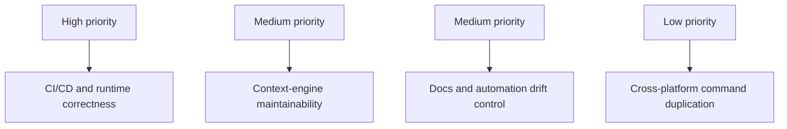

# Technical Debt

**Last Updated**: 2026-02-07

Canonical debt/simplification backlog:

- [Refactoring and Simplification Backlog](REFACTORING_SIMPLIFICATION.md)

Planned work:

- [Roadmap](ROADMAP.md)

Active implementation issues:

- [.agent/issues.md](../.agent/issues.md)

## Current Priority Snapshot

> **Note:** All initial high-priority technical debt items (R-001 through R-008) have been completed as of 2026-02-07. Please refer to `docs/REFACTORING_SIMPLIFICATION.md` for the historical record and any new initiatives.

| Priority | Theme | Canonical Item |
| :--- | :--- | :--- |
| High | CI/CD and runtime correctness | Completed |
| Medium | Context-engine maintainability | Completed |
| Medium | Docs/automation drift control | Completed |
| Low | Cross-platform command duplication | Completed (`R-008`) |

Use `docs/REFACTORING_SIMPLIFICATION.md` for detailed actions and sequencing.

## Debt Management Flow

## Theme Map

